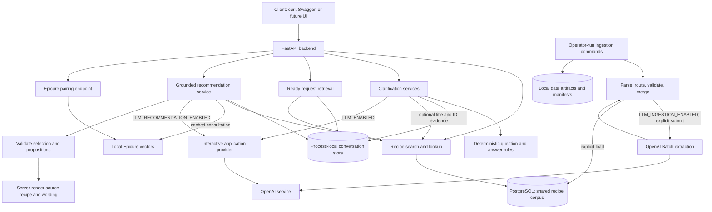
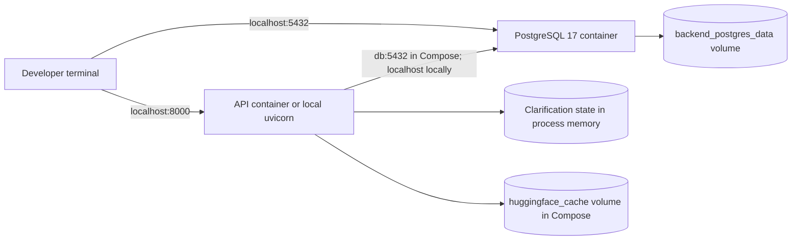

# Current system architecture

Code snapshot: **2026-09-24**, with Phase 3 accepted as a bounded backend milestone.
This describes implemented behavior, not the eventual agent design. Start here;
then read [request flows](request-flows.md) and [data and ingestion](data-and-ingestion.md).
Diagrams use Mermaid, which GitHub renders directly.

## 1. The system in plain language

The backend has four main jobs:

1. **Prepare recipe data:** explicit ingestion commands normalize dataset rows,
   optionally ask a model to interpret ambiguous text, validate results, and load PostgreSQL.
2. **Find stored recipes:** API endpoints search both datasets or fetch one canonical recipe.
3. **Clarify a cooking request:** rules and an optional model propose questions;
   typed answers update server-owned, temporary conversation state.
4. **Recommend a stored recipe:** consult Epicure, fetch source evidence, ask a
   bounded model to select, then validate and render recipe facts and propositions
   on the server.

There is no frontend, vector retrieval, or autonomous agent
loop yet. Clarification readiness feeds the implemented recommendation
workflow (source-grounded selection, backend-only), served over both
non-streaming JSON and versioned SSE streaming (Phase 4, shared
service). Phase 3's ordinary and
native-tool paths have bounded live evidence and owner acceptance based on
AI-assisted review. Structural admission does not certify completeness or
practical usefulness; see [closure and limitations](../phase3-closure.md).

Arrows show calls/data flow, not a single execution sequence. Ingestion does
not run during API startup. The two LLM paths have different prompts, schemas,
settings and lifecycles. Epicure is a local similarity model, not the LLM.

## 2. Where code belongs

All paths below are relative to `src/culinary_copilot/`.

| Area | Responsibility | Main files |
|---|---|---|
| API | HTTP validation, endpoint dispatch, lifecycle | `api/app.py`, `api/clarification.py`, `api/retrieval.py`, `api/recommendations.py` |
| Retrieval | Ready-request mapping, bounded evidence summaries | `retrieval/query.py`, `retrieval/service.py` |
| Recommendations | Grounded selection, Epicure consultation, tool mode | `recommendations/service.py`, `evidence.py`, `policy.py`, `prompts.py`, `propositions.py`, `epicure.py` |
| Domain | Cooking request, questions, answers, status and rules | `domain/requests.py`, `domain/clarification.py`, `domain/recommendations.py`, `domain/rule_planner.py` |
| Services | Planning orchestration, answer updates, concurrency | `services/clarification_service.py`, `hybrid_planner.py`, `answers.py`, `store.py` |
| Application LLM | Async provider interface, fake provider, bounded retries | `llm/client.py` |
| Recipe access | Parameterized SQL search and document lookup | `recipes/repository.py`, `search.py` |
| Ingestion | Source normalization, extraction, validation and loading | `recipes/import_data.py`, `adapters/`, `llm_batch.py`, `llm_sched.py`, supporting modules |
| Epicure | Load pinned vocabulary/vectors and calculate neighbors | `tools/epicure.py` |
| Infrastructure | Settings, database engine, planning events | `config.py`, `db.py`, `obs/clarification.py` |

Development-only dataset tools are under `scripts/datasets/`. Production code
does not import them. Tests live under `tests/`; `evals/` holds frozen retrieval evaluation inputs, the measured full-text baseline,
and recommendation review specs. Recipe-filled results stay local and ignored.
Primary full-text Recall@5 is 0.408 and MRR@5 is 0.446 over 27 relevant-labeled
units, using grade 2; incomplete judgments and held-out exposure limit the claim.
See the [corrected baseline](../../evals/results/phase1/baseline_fulltext_corrected.md).

## 3. Deployment and lifetime

- Compose runs `api` and `db`; CLI ingestion is a separate operator action.
- PostgreSQL and cached model files survive container replacement through named volumes.
- Conversation state does **not** survive an API restart. Each worker would have
  its own state: the current store is for a single-process development deployment.
- The store caps retained requests at 512 and removes associated groups on eviction.
- App startup creates the engine, services and store. It initializes the application
  provider when enabled; shutdown closes that client and disposes the engine.
- `/health/live` reports process availability; `/health/ready` checks PostgreSQL
  connectivity. Neither certifies model availability, corpus quality, or conversation persistence.

## 4. Independent switches

| Switch | Enables | Does not enable |
|---|---|---|
| `LLM_ENABLED` | Optional interactive clarification planning | Batch ingestion or recipe generation |
| `LLM_RECOMMENDATION_ENABLED` | Grounded recommendation selection (Phase 3) | Clarification planning or batch ingestion |
| `LLM_INGESTION_ENABLED` | Explicit ingestion extraction calls | Interactive clarification or recommendations |
| `EPICURE_ENABLED` | Local Epicure pairing capability | Dietary certification or automatic recommendation generation |

Defaults are disabled in code. A request can also set `use_llm=false` for rule-only
clarification. These are configuration defaults, not a claim about local `.env` values.
Clarification provider limits use `LLM_APP_*`; recommendations use `LLM_REC_*`
and `REC_*`; ingestion limits use separate settings.
One application planning operation can have bounded transport retries, so “one
planning call” does not necessarily mean exactly one network attempt.

## 5. Implemented boundaries and remaining gaps

| Capability | Current state |
|---|---|
| Dataset-aware search/lookup | Implemented across Food.com and Foodie |
| Hybrid clarification and typed answers | Implemented; model behavior tested with fakes |
| Explicit-answer correction protection | Model changes require confirmation; typed edits supported |
| Recipe context inside planning | Up to three title/ID records; not complete source documents |
| Epicure inside clarification | Helper exists, but caller supplies an empty ingredient; no effective pairing lookup |
| Clarification-to-result retrieval workflow | Implemented (Phase 1, repaired): current-group `POST /api/v1/retrieval/search` maps ready requests to eligibility/ranking search plus bounded exact-pair summaries; see `docs/retrieval.md` |
| Source-grounded recommendations | Implemented backend-only (Phase 3): `POST /api/v1/recommendations` selects one source recipe with server-rendered content, deterministic validation, and Epicure consultation or a recorded skip/degraded outcome; see `docs/recommendations.md` |
| Epicure inside recommendations | Implemented: early consultation with canonical ingredients via cached assets (`CachedEpicureAdapter`), distinct outcomes (consulted/skip/disabled/unavailable/unmapped/insufficient context), opt-in `get_recipe` tool mode |
| Substitution verification | Limited checks; suggestions remain unverified, not certified equivalents |
| Durable conversations | Not implemented |
| Recipe embeddings / pgvector | Not implemented; existing `search_vector` is PostgreSQL full text |
| Recipe rewriting, scaling, web search, agent loops | Not implemented; recommendations select and render stored sources |
| Streaming | Implemented (Phase 4): `POST /api/v1/recommendations/stream` shares the recommendation service via a stage hook; versioned stage/final/error events, bounded duration/events, disconnect cancellation |
| Complete telemetry | Implemented (Phase 4): correlated clarification + recommendation events with real ids, stage timings, per-turn usage and estimated cost from the model registry (gpt-6-luna); one event per run including cancelled runs; no message/recipe/secret logging |

Important limits: conflict checks are keyword-based; source quote matching for
inferred fields is substring-based, not semantic proof. Planning and
recommendation event logging is complete per request (rule-only and error
paths emit with real group ids; recommendation telemetry covers success,
insufficient, error, and cancelled stream outcomes).

## 6. How to verify and navigate

`make check` runs Ruff, formatting, mypy and tests/evals. Default model tests use
fake providers. PostgreSQL integration tests use disposable databases when available.
No live model reliability claim follows from fake-provider tests.

- [Clarification contracts and HTTP examples](../clarification.md)
- [Retrieval evidence summaries](../retrieval.md)
- [Grounded recommendations and Epicure](../recommendations.md)
- [Food.com import runbook](../recipe-ingestion.md)
- [Hybrid ingestion and completed local migration](../hybrid-ingestion.md)
- [Database schema and ingestion diagrams](data-and-ingestion.md)
- [Request lifecycle and concurrency diagrams](request-flows.md)
