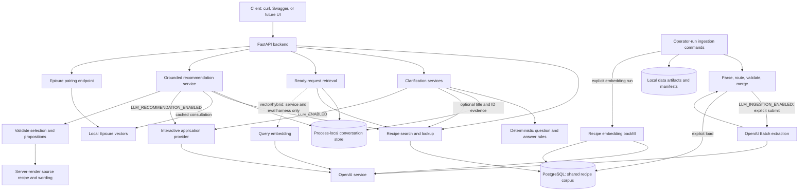
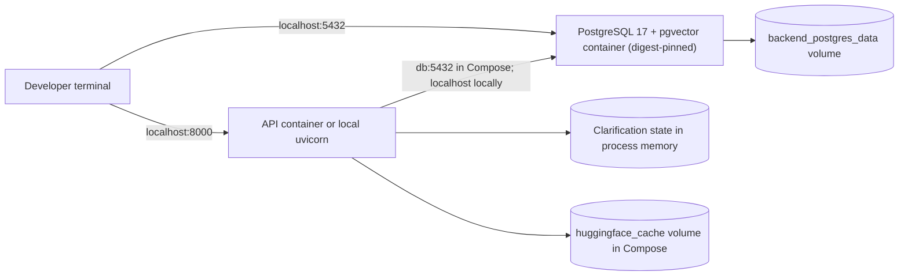

# Current system architecture

Code snapshot: **2026-09-25**. Phase 3 is accepted as a bounded backend
milestone. Phase 5 added recipe embeddings and vector/hybrid retrieval code.
Phase 6 compared the retrieval modes blind. Runtime search is still full-text
only (see §5).
This describes implemented behavior, not the eventual agent design. Start here;
then read [request flows](request-flows.md) and [data and ingestion](data-and-ingestion.md).
Diagrams use Mermaid, which GitHub renders directly.

## 1. The system in plain language

The backend has four main jobs:

1. **Prepare recipe data:** explicit ingestion commands normalize dataset rows,
   optionally ask a model to interpret ambiguous text, validate results, and load PostgreSQL.
2. **Find stored recipes:** API endpoints search both datasets or fetch one canonical recipe.
3. **Clarify a cooking request:** rules and an optional model propose questions;
   typed answers update server-owned, temporary conversation state.
4. **Recommend a stored recipe:** consult Epicure, fetch source evidence, ask a
   bounded model to select, then validate and render recipe facts and propositions
   on the server.

There is no frontend or autonomous agent loop yet. Vector and hybrid
retrieval exist in the retrieval service and the evaluation harness, but no
HTTP endpoint selects them: the API and recommendations run full-text search.
Clarification readiness feeds the implemented recommendation
workflow (source-grounded selection, backend-only), served over both
non-streaming JSON and versioned SSE streaming (Phase 4, shared
service). Phase 3's ordinary and
native-tool paths have bounded live evidence and owner acceptance based on
AI-assisted review. Structural admission does not certify completeness or
practical usefulness; see [closure and limitations](../phase3-closure.md).


```mermaid
flowchart TB
    Client["Client: curl, Swagger, or future UI"] --> API["FastAPI backend"]
    API --> Recipes["Recipe search and lookup"]
    Recipes --> PG[("PostgreSQL: shared recipe corpus")]
    API --> Clarify["Clarification services"]
    Clarify --> Rules["Deterministic question and answer rules"]
    Clarify --> Memory[("Process-local conversation store")]
    Clarify -->|"optional title and ID evidence"| Recipes
    Clarify -->|"LLM_ENABLED"| AppLLM["Interactive application provider"]
    AppLLM --> OpenAI["OpenAI service"]
    API --> Retrieval["Ready-request retrieval"]
    Retrieval --> Memory
    Retrieval --> Recipes
    Retrieval -.->|"vector/hybrid: service and eval harness only"| QueryEmbed["Query embedding"]
    QueryEmbed --> OpenAI
    API --> Recommend["Grounded recommendation service"]
    Recommend --> Memory
    Recommend --> Recipes
    Recommend -->|"cached consultation"| Epicure
    Recommend -->|"LLM_RECOMMENDATION_ENABLED"| AppLLM
    Recommend --> Validation["Validate selection and propositions"]
    Validation --> Render["Server-render source recipe and wording"]
    API --> Pairings["Epicure pairing endpoint"]
    Pairings --> Epicure["Local Epicure vectors"]
    CLI["Operator-run ingestion commands"] --> Parse["Parse, route, validate, merge"]
    Parse -->|"LLM_INGESTION_ENABLED; explicit submit"| Batch["OpenAI Batch extraction"]
    Batch --> OpenAI
    Batch --> Parse
    Parse -->|"explicit load"| PG
    CLI --> Artifacts[("Local data artifacts and manifests")]
    CLI -->|"explicit embedding run"| EmbedCLI["Recipe embedding backfill"]
    EmbedCLI --> OpenAI
    EmbedCLI --> PG
```

Arrows show calls/data flow, not a single execution sequence. The dotted
arrow is a path the HTTP API does not take today. Ingestion and embedding
backfills do not run during API startup. The two LLM paths have different prompts, schemas,
settings and lifecycles. Epicure is a local similarity model, not the LLM.

## 2. Where code belongs

All paths below are relative to `src/culinary_copilot/`.

| Area | Responsibility | Main files |
|---|---|---|
| API | HTTP validation, endpoint dispatch, lifecycle | `api/app.py`, `api/clarification.py`, `api/retrieval.py`, `api/recommendations.py` |
| Retrieval | Ready-request mapping, bounded evidence summaries, retrieval modes (full-text/vector/hybrid, cutoff, gate) | `retrieval/query.py`, `retrieval/service.py`, `retrieval/hybrid.py` |
| Embeddings | Embedding provider, query embedding, model registry, document rendering | `embeddings/provider.py`, `query.py`, `registry.py`, `rendering.py` |
| Recommendations | Grounded selection, Epicure consultation, tool mode | `recommendations/service.py`, `evidence.py`, `policy.py`, `prompts.py`, `propositions.py`, `epicure.py` |
| Domain | Cooking request, questions, answers, status and rules | `domain/requests.py`, `domain/clarification.py`, `domain/recommendations.py`, `domain/rule_planner.py` |
| Services | Planning orchestration, answer updates, concurrency | `services/clarification_service.py`, `hybrid_planner.py`, `answers.py`, `store.py` |
| Application LLM | Async provider interface, fake provider, bounded retries | `llm/client.py` |
| Recipe access | Parameterized SQL search, exact vector search, RRF fusion and document lookup | `recipes/repository.py`, `search.py`, `vector_search.py` |
| Ingestion | Source normalization, extraction, validation and loading | `recipes/import_data.py`, `adapters/`, `llm_batch.py`, `llm_sched.py`, supporting modules |
| Epicure | Load pinned vocabulary/vectors and calculate neighbors | `tools/epicure.py` |
| Infrastructure | Settings, database engine, planning events | `config.py`, `db.py`, `obs/clarification.py` |

Development-only tools are under `scripts/`:
- dataset tools in `scripts/datasets/`;
- the embedding backfill CLI in `scripts/embeddings/embed.py`;
- the retrieval evaluation harness in `scripts/retrieval_eval/`.

Production code does not import them. Tests live under `tests/`. `evals/`
holds the frozen retrieval evaluation inputs, the measured full-text
baseline, the Phase 6 development additions and freeze record, and the
recommendation review specs. Recipe-filled results stay local and ignored.

Retrieval measurements so far:
- **Full-text baseline (Phase 2):** Recall@5 0.408 and MRR@5 0.446 over 27
  relevant-labeled units at grade 2. Incomplete judgments and held-out
  exposure limit the claim. See the
  [corrected baseline](../../evals/results/phase1/baseline_fulltext_corrected.md).
- **Phase 6 blind comparison:** 20 adversarial requests, owner-judged.
  - Vector search with a 0.66 cosine-distance cutoff (`vector_c`) won under
    the frozen rule.
  - HitRate@5 was 0.812 against full-text's 0.438.
  - The cutoff returned nothing on all four requests meant to find nothing.
  - The default was not changed. See the [scoreboard](../scoreboard.md) and
    [ADR 0001](../adr/0001-retrieval-default.md).

## 3. Deployment and lifetime


```mermaid
flowchart LR
    Host["Developer terminal"] -->|"localhost:8000"| API["API container or local uvicorn"]
    Host -->|"localhost:5432"| DB["PostgreSQL 17 + pgvector container (digest-pinned)"]
    API -->|"db:5432 in Compose; localhost locally"| DB
    DB --> Disk[("backend_postgres_data volume")]
    API --> RAM[("Clarification state in process memory")]
    API --> Cache[("huggingface_cache volume in Compose")]
```

- Compose runs `api` and `db`; CLI ingestion is a separate operator action.
- `compose.yaml` pins `pgvector/pgvector:pg17-trixie` by digest. Migration
  004 created `vector` objects, so the stock `postgres:17` image can no
  longer start this database. Never swap the image back on its own.
- PostgreSQL and cached model files survive container replacement through named volumes.
- Conversation state does **not** survive an API restart. Each worker would have
  its own state: the current store is for a single-process development deployment.
- The store caps retained requests at 512 and removes associated groups on eviction.
- App startup creates the engine, services and store. It initializes the application
  provider when enabled; shutdown closes that client and disposes the engine.
- `/health/live` reports process availability; `/health/ready` checks PostgreSQL
  connectivity. Neither certifies model availability, corpus quality, or conversation persistence.

## 4. Independent switches

| Switch | Enables | Does not enable |
|---|---|---|
| `LLM_ENABLED` | Optional interactive clarification planning | Batch ingestion or recipe generation |
| `LLM_RECOMMENDATION_ENABLED` | Grounded recommendation selection (Phase 3) | Clarification planning or batch ingestion |
| `LLM_INGESTION_ENABLED` | Explicit ingestion extraction calls | Interactive clarification or recommendations |
| `EPICURE_ENABLED` | Local Epicure pairing capability | Dietary certification or automatic recommendation generation |

Defaults are disabled in code.

Embedding and retrieval-mode settings are validated at load but do not yet
change runtime behavior. That covers `EMBEDDINGS_ENABLED`, `EMBEDDING_*`,
`RETRIEVAL_MODE`, `RETRIEVAL_VECTOR_CANDIDATES`, `RETRIEVAL_RRF_K`,
`RETRIEVAL_VECTOR_CUTOFF` and `RETRIEVAL_FULLTEXT_GATE`. No API route or
recommendation path reads them, so setting them does not switch search to
vector or hybrid. The mode, cutoff, gate and fallback are parameters of
`retrieve_for_group` and `retrieve_with_mode`. Today only the evaluation
harness and tests pass them. The embedding backfill CLI takes its own
explicit options and budget. A request can also set `use_llm=false` for rule-only
clarification. These are configuration defaults, not a claim about local `.env` values.
Clarification provider limits use `LLM_APP_*`; recommendations use `LLM_REC_*`
and `REC_*`; ingestion limits use separate settings.
One application planning operation can have bounded transport retries, so “one
planning call” does not necessarily mean exactly one network attempt.

## 5. Implemented boundaries and remaining gaps

| Capability | Current state |
|---|---|
| Dataset-aware search/lookup | Implemented across Food.com and Foodie |
| Hybrid clarification and typed answers | Implemented; model behavior tested with fakes |
| Explicit-answer correction protection | Model changes require confirmation; typed edits supported |
| Recipe context inside planning | Up to three title/ID records; not complete source documents |
| Epicure inside clarification | Helper exists, but caller supplies an empty ingredient; no effective pairing lookup |
| Clarification-to-result retrieval workflow | Implemented (Phase 1, repaired): current-group `POST /api/v1/retrieval/search` maps ready requests to eligibility/ranking search plus bounded exact-pair summaries; see `docs/retrieval.md` |
| Source-grounded recommendations | Implemented backend-only (Phase 3): `POST /api/v1/recommendations` selects one source recipe with server-rendered content, deterministic validation, and Epicure consultation or a recorded skip/degraded outcome; see `docs/recommendations.md` |
| Epicure inside recommendations | Implemented: early consultation with canonical ingredients via cached assets (`CachedEpicureAdapter`), distinct outcomes (consulted/skip/disabled/unavailable/unmapped/insufficient context), opt-in `get_recipe` tool mode |
| Substitution verification | Limited checks; suggestions remain unverified, not certified equivalents |
| Durable conversations | Not implemented |
| Recipe embeddings / pgvector | Implemented (Phase 5): migration 004 adds pgvector and `recipe_embeddings`. There is one `text-embedding-3-small` 1536-dimension vector per recipe, and search is an exact cosine scan with no HNSW index. `search_vector` is still the separate PostgreSQL full-text column |
| Vector / hybrid retrieval | Implemented in the service, not exposed. Vector mode, RRF hybrid, the distance cutoff (explicit `vector_cutoff_abstention`) and the full-text gate are tested and measured, and Phase 6 compared them blind. The HTTP retrieval endpoint and recommendations still call full-text. Adopting a mode needs code wiring plus owner approval (ADR 0001), not just an environment variable |
| Recipe rewriting, scaling, web search, agent loops | Not implemented; recommendations select and render stored sources |
| Streaming | Implemented (Phase 4): `POST /api/v1/recommendations/stream` shares the recommendation service via a stage hook; versioned stage/final/error events, bounded duration/events, disconnect cancellation |
| Complete telemetry | Implemented (Phase 4): correlated clarification + recommendation events with real ids, stage timings, per-turn usage and estimated cost from the model registry (gpt-6-luna); one event per run including cancelled runs; no message/recipe/secret logging |

Important limits: conflict checks are keyword-based; source quote matching for
inferred fields is substring-based, not semantic proof. Planning and
recommendation event logging is complete per request (rule-only and error
paths emit with real group ids; recommendation telemetry covers success,
insufficient, error, and cancelled stream outcomes).

## 6. How to verify and navigate

`make check` runs Ruff, formatting, mypy and tests/evals. Default model tests use
fake providers. PostgreSQL integration tests use disposable databases when available.
No live model reliability claim follows from fake-provider tests.

The pgvector tier (`PGVECTOR_TEST_URL`, `tests/test_embeddings_pg.py`) needs
a disposable database whose name contains `test`, `disposable` or `check`.
The tier migrates and seeds that database itself (three recipes), so a
fresh `pgvector/pgvector` container is enough:

```sh
docker run -d --rm --name cc-pgv-test -e POSTGRES_USER=t -e POSTGRES_PASSWORD=t \
  -e POSTGRES_DB=cc_disposable_test -p 127.0.0.1:55439:5432 \
  pgvector/pgvector:pg17-trixie@sha256:724a4041afdb1750446e3f6b5cfa8f3b0ac5a2cf538ddfa6bfee4f94c2fa85c6
PGVECTOR_TEST_URL=postgresql+psycopg://t:t@127.0.0.1:55439/cc_disposable_test \
  uv run pytest -q tests/test_embeddings_pg.py
docker stop cc-pgv-test
```

- [Clarification contracts and HTTP examples](../clarification.md)
- [Retrieval evidence summaries](../retrieval.md)
- [Phase 6 retrieval scoreboard](../scoreboard.md)
- [ADR 0001: retrieval default](../adr/0001-retrieval-default.md)
- [Grounded recommendations and Epicure](../recommendations.md)
- [Food.com import runbook](../recipe-ingestion.md)
- [Hybrid ingestion and completed local migration](../hybrid-ingestion.md)
- [Database schema and ingestion diagrams](data-and-ingestion.md)
- [Request lifecycle and concurrency diagrams](request-flows.md)
