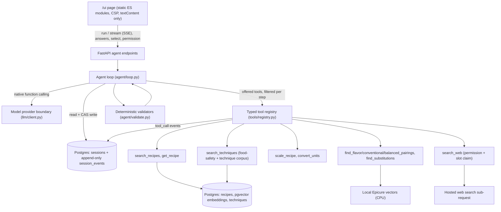

# The agent system

Part of the [current architecture](README.md). Code snapshot:
2026-10-05 (Milestone 3, Phase 7 complete; checkpoint C answered,
milestone acceptance pending).

This page explains how the cooking agent works, end to end. It is meant
to be read in one sitting. The detailed contracts are in
[agent](../agent.md), [tools](../tools.md), [sessions](../sessions.md)
and [ADR 0002](../adr/0002-agent-loop.md).

## 1. What it does

A user describes a meal ("Give me the creamy chicken curry recipe",
"Vegan dinner, something hearty"). The agent:

1. searches a corpus of stored recipes;
2. consults Epicure, a local ingredient-pairing model;
3. asks one question when the answer would change the result;
4. offers 2–3 sourced options;
5. after the user picks one, produces a cooking plan with food-safety
   references.

With the user's permission, it can also search the web and answer with
cited pages.

The model chooses what to do next. Code decides what is allowed to
reach the user.

## 2. Design principles

| Principle | How it shows up |
|---|---|
| The model proposes, code disposes | Every final answer passes deterministic validators before the user sees it. Rejected answers are sent back once as feedback, then the run stops. |
| Tool outputs are data, never instructions | The task framing says so. Recipe text, technique chunks and web pages travel as `function_call_output` data. Nothing in them can widen permissions or budgets. |
| Deny by default | Web search is off per session and enforced in the backend, not just hidden in the UI. Paid and network tools are labelled by cost class. |
| Bounded by construction | Budgets are per session and server-set (12 steps, 12 tool calls, 60k input and 12k output tokens) plus 90 s of wall clock per run. Each stop has a stable reason and a `next_action`. |
| Fail typed, not loud | Tool failures are typed results (`invalid_arguments`, `timeout`, `unavailable`, `tool_not_configured`) that the model can act on. Permanent failures are not offered again. |
| State lives in the database | Sessions use compare-and-swap writes. Events are append-only, enforced by a Postgres trigger. A restart loses nothing. |
| Unknown stays unknown | Unknown quantities and unverified dietary or allergen status are shown as unknown, never guessed. |

## 3. Components



| Part | File | Role |
|---|---|---|
| Loop | `agent/loop.py` | Step control, context assembly, budgets, stop reasons, finish handling |
| Validators | `agent/validate.py` | Evidence, quantity, constraint, allergen, citation and plan-attribution checks |
| Registry | `tools/registry.py` | Pydantic argument models (`extra="forbid"`), server-set timeouts, cost class, typed errors, event logging |
| Tools | `tools/*.py` | 10 tools across recipes, Epicure, measurement, techniques and web |
| Sessions | `domain/sessions.py`, migration `005` | Phase table, budgets, CAS revisions, append-only events |
| API | `api/agent.py` | Run, SSE stream, answers, select, permission |
| UI | `web/` | Message box, streamed stages, cards per answer shape, question answering, search toggle |

The loop is hand-written, without a framework: about 3,700 lines for
the loop and 1,400 for the validators. A
framework would replace the step loop, call fan-out and history
bookkeeping. It would not replace the session schema, the registry,
permission enforcement, the validators or the spend ledger. Those are
product and safety boundaries, not orchestration (ADR 0002).

## 4. One run, step by step

```mermaid
sequenceDiagram
    participant U as User (/ui)
    participant A as Agent API
    participant L as Loop
    participant S as Session store
    participant M as Model
    participant T as Tools
    participant V as Validators
    U->>A: message (expected_revision)
    A->>L: run_agent(session_id)
    loop until a stop reason
        L->>S: read session; check budgets and wall clock
        L->>L: build turn input (framing + snapshot + evidence digest + capped history)
        L->>M: offered tools + directive schema
        alt tool calls
            M-->>L: function calls
            L->>T: run in parallel, record in call order
            T-->>S: tool_call events (outcome, latency, cost class, identities)
            L->>S: CAS update + agent_step event
        else ask_user
            M-->>L: question
            L->>S: store question; phase clarify
            L-->>U: stop agent_needs_user_input
        else finish
            M-->>L: options / plan / technique answer / web answer
            L->>V: deterministic checks
            alt accepted
                L->>S: suggestions or plan + finish event
                L-->>U: stop agent_sufficient_evidence
            else rejected
                L->>M: feedback once (names the failed check)
            end
        end
    end
```

Stops: `agent_sufficient_evidence` and `agent_needs_user_input` are
normal endings. The error stops are:

- `agent_max_steps`, `agent_tool_budget_exhausted` and
  `agent_token_budget_exhausted`: 422, start a new session;
- `agent_wall_clock_exceeded`: 408, retry;
- `agent_no_progress` and `agent_validation_failed`: 422.

Before `agent_no_progress`, the loop tries once to recover: when a
step only repeats earlier calls with identical results, the next
turn withholds the repeated tools and asks the model to use what it
has: fetch candidates it has not fetched yet, or answer (a wrap-up
turn). Until 2026-10-07 the wrap-up offered no tools at all; with
one recipe fetched, the model could then only ask the user a
question. A rejected wrap-up answer is retried with the same tools
withheld; repeating the same call a third time still stops the run.
A repeat `get_recipe` that returns the "already fetched" pointer
counts as a repeat for both rules, even though the pointer differs
from the full output it points at. An identical repeated search is
marked in its output as returning nothing new, and a full-text
search with fewer than 3 results suggests broadening the query.

When a batch asks for more tool calls than remain, the affordable
prefix runs and the model gets one finishing turn without tools
instead of stopping at once (H4, 2026-10-08). It is the ordinary final
turn (`offered=[]`) and passes the same step, wall-clock and token
checks as every turn; the token ceilings and the wall clock are the
spending limits. It happens at most once per run and ends the run: a
valid finish or question completes; a rejected finish (no retry on a
final turn) or a tool call stops. When a check fails or the turn is
rejected, the run stops with `agent_tool_budget_exhausted` (reason
unchanged) and a deterministic message listing fetched recipes,
options, the selected dish and the plan. Step and token stops list the
same results. Allowances are never reset or raised.

The UI renders one outcome card per reason.

## 5. Context management

Every turn is rebuilt from durable state. Nothing depends on a long
in-memory transcript.

- **Task framing:** fixed rules, covering data versus instructions,
  never relaxing constraints, labelling adaptations, the answer shapes
  and the Epicure policy.
- **Session snapshot:** constraints, confirmed answers, open questions,
  remaining budgets and Epicure status.
- **Evidence digest:** rebuilt from `session_events` every turn. It
  lists searches, fetched recipes, web sources and technique hits, so
  the model knows what it already has after history is trimmed or a
  new run starts.
- **Capped history:** the newest whole turn groups up to 13 items,
  plus older whole groups while the history stays within 16,000
  characters (at most 31 items), so small outputs such as pairings
  are not pushed out by one large recipe step. The character limit is
  a retention heuristic, not a token or spending guarantee: the
  input-token ceiling and the run budgets limit spending. A function
  call is never separated from its output. Each tool output
  is summarized to IDs and the facts needed, bounded at 4,000
  characters (6,500 for technique search, whose hits carry
  attribution and 600-character excerpts; 9,000 for `get_recipe`)
  with structural truncation that stays valid JSON.
- **Repeat fetches:** a recipe already visible in the run is not
  re-sent. The model gets a named pointer to its earlier output, never
  an empty recipe it could misread as "no directions".
- **Recipe evidence:** ingredients plus bounded directions (up to 12,
  each up to 600 characters), with `directions_total`,
  `directions_shown`, `directions_truncated` and `directions_clipped`
  (directions cut at 600 characters, which end with "…"). "The source
  has no directions" and "directions were cut here" are therefore
  different facts. The bound was 6 x 200 until 2026-10-07: 64% of
  corpus recipes had a longer direction, and the cut was silent; now
  184 of 16,033 recipes have a clipped direction. Since 2026-10-08
  (H3) the model reads omitted text with `get_recipe`
  `directions_from`/`to` (0-based, at most 12 full directions per
  call, each response within its output limit and naming what it
  still omits); 605 of 16,033 recipes need the path.
- **Visibility-aware de-duplication:** a repeated `get_recipe` returns
  a short pointer only when the full document is still in the model's
  visible history. Otherwise it returns the full document. Ranged
  reads never return the pointer: the same pair with a direction range
  is new evidence (same range twice shares a digest and counts as a
  repeat for wrap-up and stall).
- **Token accounting:** before each turn, the loop estimates everything
  it will send (items, tool definitions, directive schema) and stops
  before crossing the ceiling. The final turn is sent with no tools, so
  the model must answer or ask.

## 6. Memory and state

- **Short-term:** the capped history inside one run.
- **Session memory:** the `sessions` row, which holds:
  - the phase, constraints and answers;
  - the selected dish and remaining budgets;
  - the search permission and a revision number.

  Every write is compare-and-swap, so a concurrent run loses loudly
  with 409 and never silently overwrites.
- **Event log:** `session_events` is append-only (a trigger rejects
  UPDATE and DELETE). It records user messages, steps, tool calls,
  questions, answers, selections, validation rejections and finishes.
  Review tools, the evidence digest and the validators all read the
  same log.
- **Phases as data:** `discover`, `clarify`, `research`, `recommend`,
  `select`, `plan`, `cook` and `plate`, with an explicit transition
  table. An illegal model-requested move fails with
  `invalid_phase_transition`.
- **Durability:** sessions survive an API restart. The offline case
  `p7-restart-survives` asks a question, restarts, answers, resumes and
  finishes.

There is no long-term user memory across sessions by design. Each
session starts from the request.

## 7. Human in the loop

| Approval point | Mechanism |
|---|---|
| Missing information | `ask_user` stops the run. `POST …/answers` merges the answer (CAS) and the next run resumes with it. |
| Choosing a dish | `POST …/select` records the pick; the next finish must be a plan for exactly that dish. |
| Dietary constraint | The page's Diet selector sets `dietary_constraints` (vegetarian or vegan) when the session is created. It is a hard constraint: every option is checked against its ingredient list and is never relaxed. |
| Internet access | The operator switch `WEB_SEARCH_ENABLED` (off by default) connects a search provider at all. Then the per-session toggle, off by default. `search_web` is offered only when it is on, and re-checks permission inside an atomic slot claim (at most 3 per session). |
| Budget exhaustion | The stop says what to do next (start a new session or retry) and lists the useful results already held (fetched recipes, options, selected dish, plan). The UI shows a matching card (reason unchanged; the message carries the list). |

## 8. Guardrails: what the validators enforce

The validators run on every finish, with no model call:

- **Identity:** each option resolves by exact `(dataset_id, source_id)`
  and was returned in this session.
- **Quantities:** any stated quantity must match the fetched document
  exactly (rational comparison).
- **Constraints:**
  - hard dietary constraints are checked against ingredient lines;
  - ambiguous terms stay `unverified`, for example broth, or Parmesan
    for vegetarians (usually made with animal rennet);
  - allergen checks use three tiers (violated, unverified,
    no_listed_terms_found), never "safe", with a disclaimer;
  - the checks read listed ingredients only and cannot rule out
    cross-contact;
  - a confirmed answer counts as allergy evidence when the session
    mentions an allergy or avoidance, when its question asked about
    one, or when the answer itself states one. A plain dish choice
    ("Creamy mushroom pasta") is not read as a wheat allergy.
- **Claims:** pairing terms in the note must appear in session evidence.
  Times and temperatures must appear in the cited chunk or recipe.
- **Plans:**
  - the source must be the selected dish, fetched in full;
  - mass and volume amounts in the plan text must equal an amount the
    source states for the same ingredient with the same unit
    (hardening step H2, `agent/plan_quantities.py`; amounts reach the
    model in the source's own notation, and the UI shows 11/2 as a
    mixed number). Amounts are tied to ingredients by the names in the
    same line: whole words, ignoring function words, size words,
    containers and, when a real name is present, descriptors. An
    amount passes if any ingredient its name can refer to states it. A
    step may also rely on a cited direction that states the amount for
    the same ingredient; amounts tied to no ingredient pass only
    through a cited direction. Rules, limits and corpus counts are in
    `docs/agent.md` (self-check script
    `scripts/datasets/h2_quantity_selfcheck.py`);
  - steps are labelled `source` only when each step cites a stored
    direction that supports it and every direction is covered;
    otherwise `model_adaptation`. When the source has directions,
    the app writes the adaptation note itself, naming the steps and
    the words that differ; an ingredient-only source still needs the
    model's own admission. Matching folds accents and ignores bare
    citation tags in step text. Since H3 (2026-10-08) a plan for a
    recipe with omitted directions (clipped tail or index beyond 11)
    also needs every omitted index read full in this run via ranged
    `get_recipe`, or an adaptation naming each unread index plus
    `model_adaptation` (the turn input states this, with the exact
    call, before the plan is drafted); attribution already checks full
    stored directions, so ranged reads count;
  - raw meat, poultry, fish or eggs require a food-safety technique
    reference (technique search treats chicken, turkey, duck and goose
    as also matching "poultry", the word the FDA guidance uses). Once
    a dish is selected, the turn input states this requirement up
    front instead of leaving it to a rejected plan;
  - a plan that claims the source has no directions is rejected when
    it does;
  - since H3 part 2 (2026-10-08) a `model_adaptation` plan whose note,
    adaptation or plan text claims the steps follow, match or
    reproduce the source is rejected (deterministic patterns with
    negation handling; a `source` plan is unaffected). The plan final
    carries the model note with the validated `steps_source`, and the
    UI shows that label next to the note as well as on the steps.
- **Web answers:**
  - every URL must come from the provider's own citation evidence for
    this session;
  - numbers fail closed;
  - procedural cooking method is rejected (discovery only: pointers
    plus page descriptions).
- **Epicure:** queried by default. A skip needs an allowlisted reason,
  and a consulted finish must name returned pairings.

## 9. Security and privacy

- **Permissions:**
  - web search is permission-gated per session in the backend;
  - the session ID is bound by the server, never passed as a tool
    argument (argument models forbid extra fields).
- **Prompt injection:**
  - retrieved content is framed as data;
  - validators check facts against stored evidence, not the model's
    account of them.
- **Output handling:**
  - the UI renders with `textContent` only;
  - links pass through `safeLink` (http and https only,
    `noopener noreferrer`);
  - a strict Content-Security-Policy is set by a pure ASGI middleware.
- **Data minimization:**
  - tool events store an argument digest, not the raw arguments, by
    default;
  - when raw trajectories are recorded for review, emails, phone
    numbers, street addresses and named people are scrubbed;
  - no private model reasoning is stored;
  - search events have a documented purge procedure.
- **Secrets:** kept in `.env`, out of Git and logs. Default tests need
  no keys.

## 10. Observability and cost

- **Event log:** every tool call records outcome, error type, reason,
  latency, cost class, mode and returned identities. Every step
  records remaining budgets and token usage. Every turn records one
  `agent_turn` decision event (H7): the tools offered and withheld
  with the reason each (`search_permission_off`, `epicure_disabled`,
  `tool_not_configured`, `no_servings`, `select_phase_plan_only`,
  `repeat_wrap_up`, `final_turn_no_tools`, `mode_not_configured`),
  the repeated results it saw (`repeated_tools`, `repeat_noted` on
  the step event), validation failures with the budgets they leave
  behind, and the remaining step/tool/token budgets. A provider
  reasoning summary, when returned, is stored once on that turn's
  outcome event as a bounded diagnostic labelled
  `provider_reasoning_summary` (500 chars) and never used for a
  decision; raw or encrypted reasoning content is never recorded. All
  payloads stay bounded.
- **Full trajectories (opt-in):** with `AGENT_RECORD_TRAJECTORY=true`
  (on in `make demo`), the log also records:
  - tool arguments;
  - what each tool returned to the model;
  - every model directive, including rejected answers;
  - each run's result.

  All text is scrubbed of personal details and bounded.
  `scripts/sessions/export_session.py` exports a session as JSON plus a
  readable timeline. It reads inside a read-only transaction.
- **Streaming:** SSE stage events show progress (concise outcomes,
  never recipe text or reasoning) and end in exactly one `final` or
  `error`.
- **Live runs:** go through a runner with a spend ledger:
  - each model turn reserves its worst-case cost before it is sent;
  - each search reserves its estimate;
  - a turn that cannot be afforded stops the scenario;
  - pools and ceilings are cumulative, and every limit is enforced
    inside the run, not just at preflight.
- **Spend:** Milestone 3 used about $0.28 of a $1.00 budget across all
  live evaluation.

## 11. Evaluation

| Layer | What it proves | Size |
|---|---|---|
| Unit and integration tests | Contracts, validators, tools, CAS, UI headers (`make check`, disposable databases) | 1,271 passed, 8 skipped |
| Offline scenario harness (`evals/phase7_agent/run.py`) | The real loop, tools and validators against scripted model turns, including adversarial ones (skipped Epicure, invented URL, bad arguments, illegal transition) | 55/55 cases (v10), 4/4 adversarial caught |
| Scorer mutation tests | Each scoring check actually fails when the behaviour breaks | `tests/test_phase7_scorer.py` |
| Bounded live runs | What the real model does: 7 scenarios, then 4 re-runs after fixes, all trajectories saved | First run 3/7 expected stops; re-runs 2/4 |
| Human checkpoint | The owner reads live trajectories beside their sources | Checkpoint C |

How a live finding becomes a regression test: each live failure is
reproduced as a scripted offline case, fixed, and pinned before any
re-run. Examples:

- the time-claim loop;
- redundant fetches;
- the plan that ignored its source directions;
- the web answer that taught a method.

The harness version and case hash are recorded, so a changed case
means a new version.

Offline results measure the system, not the model's judgement. Live
recovery after an answer, and allergy-aware options after resuming,
are not yet shown live. They are Milestone 4 acceptance items.

## 12. Known limits and next steps

- **Single agent.** Multi-agent designs, LangGraph and a tracing
  platform are scheduled for Milestone 4; deployment and CI regression
  gates for Milestone 5. CI already runs `make check` and a Docker
  smoke test.
- **Keyword-based checks.** Dietary, allergen, claim and web-method
  checks are deterministic and conservative, not semantic. A
  single-verb instruction can pass the web guard.
- **Few live runs.** Live evidence is 11 sessions and one web search:
  diagnostic, not a benchmark.
- **Budget stops.** Two live flows ended on the tool budget after a
  resume. The fixes are offline only until a live re-run.
