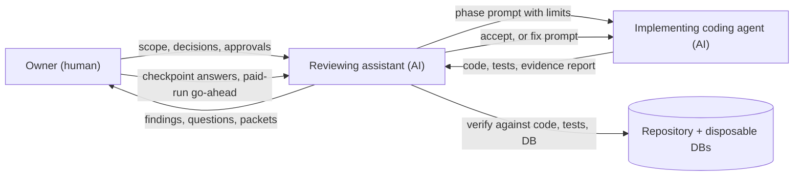

# How this system is built: agentic development workflow

Part of the [current architecture](README.md). This page describes the
engineering process, not the runtime. For the runtime, see
[the agent system](agent-system.md).

This repository is built with AI coding agents, directed and gated by
a human owner. The process is designed so that
the agents do the volume of work and the human keeps every decision
that is costly, irreversible or a judgement of quality.

## 1. Roles

| Role | Does | Never does |
|---|---|---|
| Owner (human) | Sets scope and milestones. Answers checkpoint questions. Authorizes each paid run, migration and commit. Reads live trajectories beside their sources. | Delegates a checkpoint decision. |
| Reviewing assistant (AI) | Writes paste-ready phase prompts. Verifies each report against code, tests and the database. Writes fix prompts. Runs authorized commands. Records owner decisions. | Signs a checkpoint, starts a paid run without the owner's go-ahead, or edits owner records on an agent's behalf. |
| Implementing coding agent (AI) | Implements one phase. Writes tests and evaluation harnesses. Reports checks, skips and limits. | Commits, migrates the app database, makes paid calls, edits `.env` or frozen artifacts. |

These are two separate agent sessions with different instructions and
context. The reviewer's main rule is: **check the code, not the
report**.

## 2. Standing context and guardrails

- **`AGENTS.md`:** repo conventions every coding agent reads first.
  Production code must not import `scripts/`, data identity is
  `(dataset_id, source_id)`, unknowns stay unknown, validation is never
  weakened to pass tests, and DB write tests use disposable databases
  only.
- **Shared instructions:** a block attached to every phase prompt
  ([execution plan](../milestone-3-execution-plan.md)). It covers scope,
  forbidden actions (paid calls, migrations, commits, pushes),
  data-versus-instructions, and the reporting format.
- **Frozen artifacts:** applied migrations, evaluation cases and earlier
  live-scenario sets are never edited. A change means a new version
  with a new hash, recorded in the results.
- **Decision records:** ADRs plus per-phase owner decision files (for
  example `docs/phase7-owner-decisions.md`). Each decision is marked
  "Recorded by an AI assistant; not a signature."

## 3. Phases and human checkpoints

Each milestone is split into phases. Each phase is one prompt, one
evidence report and one verification. Human checkpoints sit where
judgement or money is involved:

| Checkpoint | Owner decides |
|---|---|
| 0 | Model, budgets, retrieval default, Epicure policy, what is out of scope |
| A | Offline trajectories are acceptable; live budget approved |
| B | Search provider, cost cap and timeout; logs and gap queue reviewed |
| C | Real trajectories read beside their sources: Were claims supported? Were constraints relaxed? Were citations real and relevant? |

## 4. The verification loop

For every report, the reviewer:

1. reads the changed code, not just the summary;
2. reruns `make check`, the offline harness and any verification
   scripts;
3. probes edge cases directly (small read-only scripts, a server
   started with the model off, read-only database queries);
4. compares claims with raw artifacts (trajectories, summaries,
   database rows);
5. either accepts the report or writes a fix prompt naming the exact
   defect, the file and the required tests.

Defects caught this way, before they shipped:

- **Duplicate-fetch regression.** An efficiency fix returned "already
  fetched" pointers across runs. Each new run starts with an empty
  history, so the plan step after selection would have lost the
  recipe. It was rescoped to what the model can still see, with three
  regression tests.
- **Trusted model text.** A pairing check accepted dish titles written
  by the model as evidence. It now uses only stored titles and user
  messages.
- **Citation provenance.** An external review found web URLs accepted
  without provider evidence. Now only URLs in the provider's own
  citation evidence count.
- **Middleware side effect.** A response-header middleware changed how
  client disconnects were recorded. It was replaced with pure ASGI
  middleware, and a test now checks the recorded reason, not just that
  cancellation happened.
- **Loose scoring.** Harness checks that passed on the stop reason
  alone were tightened to pin the guard evidence. Mutation tests prove
  each check fails when the behaviour breaks.
- **Overstated evaluation packet.** A packet claimed a live
  ask-and-resume that the raw trajectory did not show. It was
  corrected, and `verify_packet.py` now rechecks each live claim
  against the raw files.

The human checkpoint still found what automated review missed. At
checkpoint C, the owner found a plan that ignored its source directions
yet was labelled "source", and a web answer that taught a cooking
method. Both became validators and regression cases.

## 5. Governance for paid and irreversible actions

- **Per-run authorization:** each paid run needs its own go-ahead with
  a stated ceiling. Approval for one run never carries over to the
  next.
- **Ledger:** the live runner reserves worst-case cost before each
  model turn and each search. Pools and ceilings are cumulative.
  Acknowledgement flags must match the recorded decision.
- **Enforced inside the run:** each limiting flag is traced to its
  check inside the run, and each check has an offline test.
- **Environment check:** before a paid run, the runtime environment is
  compared with the last known-good run. This was added after a run
  went out with embeddings disabled. Preflight now refuses that
  configuration.
- **Database safety:** write tests run only on databases whose name
  marks them as disposable. Application migrations need a verified
  backup.
- **Outcome:** Milestone 3 live evaluation spent about $0.28 of its
  $1.00 budget.

## 6. From experiment to production

Each capability follows the same path:

1. offline implementation with fake providers;
2. a scripted scenario harness, including adversarial cases;
3. a bounded live run with saved trajectories;
4. owner review;
5. each live failure reproduced as an offline regression case;
6. a fix, pinned before any re-run.

The Phase 7 live run surfaced six defects (a configuration gap, a
time-claim loop, redundant fetches, a misused constraint field, a plan
attribution gap and a method-teaching web answer). All six are fixed
and pinned offline. Live confirmation is a Milestone 4 acceptance item.

## 7. In numbers (2026-10-05)

| Measure | Value |
|---|---|
| Commits since 2026-09-15 | 36 |
| Tests (`make check`) | 1,192 passed, 8 skipped |
| Offline agent scenarios | 43 (4 adversarial), all passing |
| Live agent sessions reviewed | 11 (7 first run, 4 re-runs) |
| Milestone 3 live spend | about $0.28 of $1.00 |
