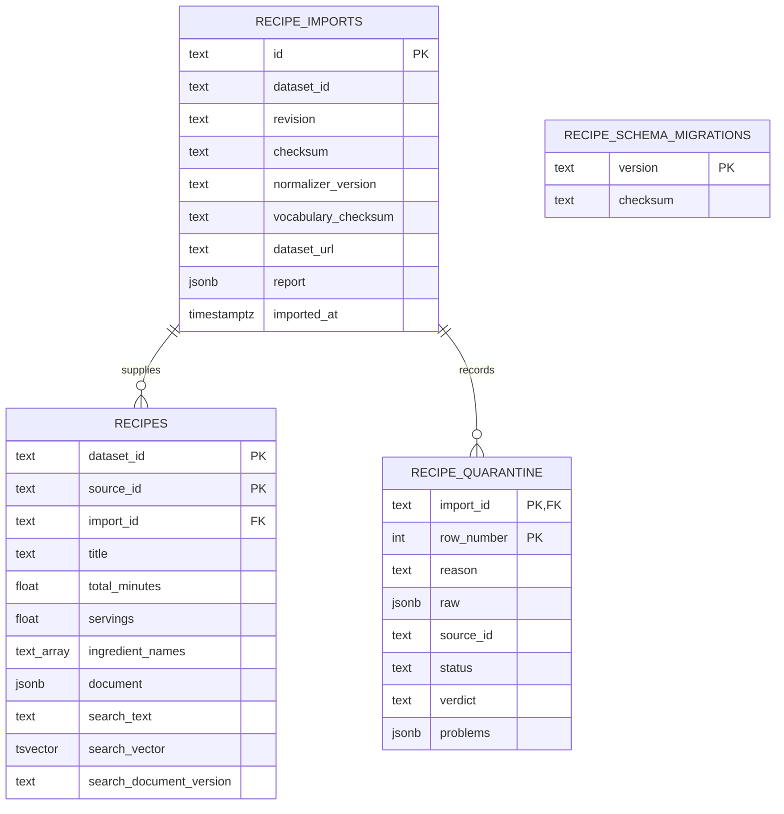
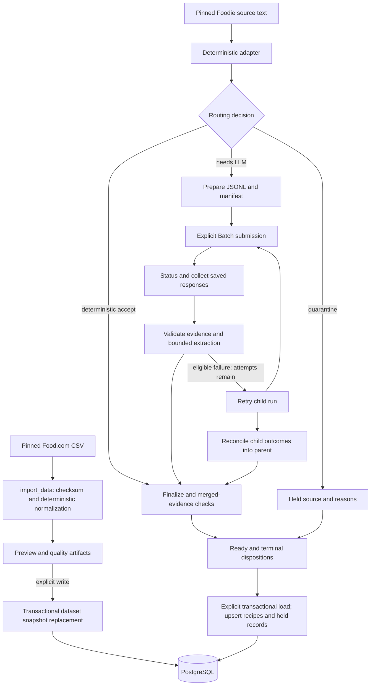

# Data storage and ingestion

Part of the [current architecture](README.md). SQL definitions live in
`src/culinary_copilot/recipes/migrations/`; the migration ledger is created by
`apply_migrations()` in `import_data.py`.

## 1. One database, one shared recipe table

Both Food.com and Foodie occupy `public.recipes` in the same PostgreSQL database.
`dataset_id` identifies the source; it does not select a different database/schema.

`(dataset_id, source_id)` is the composite recipe key. Quarantine uses
`(import_id, row_number)`; its dataset comes through the import record.
The migration ledger is independent of the recipe relationships. `float` and
`text_array` above abbreviate SQL `double precision` and `text[]`.

### Columns versus JSON

Searchable columns support fast filtering. `document` is the complete structured
recipe: ingredients, instructions, raw fields, provenance, and available quality
metadata. The JSON documents are not perfectly uniform across import generations:
older Food.com documents lack some newer Foodie capability and quality fields.
Consumers must handle absence as unknown, not assume validation succeeded.

`search_vector` is a generated PostgreSQL **tsvector**, an indexable representation
of words. It is not an embedding. GIN indexes support full-text and ingredient-array
queries; a duration index supports time filtering. No vector extension/table exists.

### Migration history

- **001:** imports, recipes, quarantine and indexes.
- **002:** search-document renderer version column.
- **003:** quarantine source ID, status, verdict and problem details.

Applied migration checksums are preserved; changes require new SQL migrations.
Startup does not run migrations. Explicit ingestion/load commands can apply them.

### Recorded local migration snapshot

The completed migration report records 1,216 Food.com + 14,817 Foodie recipes
(**16,033 total**) and 12 + 431 quarantine rows (**443 total**). These are historical
local counts, not an automatic seed or a live count rechecked for this documentation.
See [the migration runbook section](../hybrid-ingestion.md#completed-foodie-migration-2026-09-23).

## 2. Two ingestion paths

This is a lifecycle diagram, not an automatic promise that every arrow runs.
Model outputs are proposals; Python owns validation, merged evidence, capabilities,
retry eligibility, and the decision to admit a record. Partial records can remain
useful evidence with scaling and completion restricted. Pending work is distinct
from terminal rejection; full loads block on pending records unless partial loading
is explicitly selected.

- **Food.com importer:** preview by default; explicit write replaces that dataset's
  current accepted snapshot in a transaction. It does not replace other datasets.
- **Foodie Batch loader:** upserts ready rows and terminal held records. It does
  not use Food.com's snapshot-replacement policy.
- **Scheduler:** wraps the Batch lifecycle with persisted queue state, slot limits,
  spend reservations, reviews, stop rules, retries and reconciliation. It is a CLI
  tool, not an always-running API service. Scope and limits are run configuration.
- **Cache:** keys capture interpretation inputs; validator/merge versions protect
  reuse. Revalidation of saved responses can be offline, without new paid calls.
- **Exact deduplication:** `exact_duplicates.py` groups identical raw source text,
  preserving source aliases and alternate interpretations. It was used in migration
  preparation; it is not automatically wired into every ordinary ingestion command.

## 3. What persists where

| Location | Contents | Lifetime |
|---|---|---|
| PostgreSQL volume | Canonical recipes, quarantine, import reports, migration ledger | Durable across container restarts |
| API process memory | Cooking requests, questions, answers, confirmations, revisions | Lost on restart; bounded eviction |
| Ignored `data/` | Batch manifests, responses, reviews, migration package and backup | Local files, not Git or conversation storage |
| Model cache | Pinned Epicure vocabulary and vectors | Local cache / Docker volume |
| Git repository | Code, migrations, tests, selected fixtures and maintained docs | Versioned; no runtime dataset corpus |

Foodie exact duplicates retain `source_records` and `duplicate_interpretations`
in the canonical JSON document; the migration's `aliases.json` also maps original
IDs. Those aliases do not create separate API-addressable recipe rows.

Boundary/structural cases remain outside the admitted scope or held for later work.
Quarantine is excluded from ordinary recipe search. There is no automatic stronger-model
fallback or full-corpus expansion merely because a prior evaluation used one.

## 4. Operational separation

Interactive clarification can read recipe metadata, but does not import or write recipes.
Ingestion writes occur only through explicit operator commands. Regression tests use
saved/synthetic data and fake providers; integration tests write only disposable databases.

Detailed commands, limits and recovery evidence belong in the maintained
[Food.com](../recipe-ingestion.md) and [hybrid](../hybrid-ingestion.md) runbooks.

## 5. Runtime reads, quarantine history and review records

Recommendation search and exact lookup read `recipes`, not `recipe_quarantine`.
A quarantined-only identity is never offered. An accepted version can still be
served when quarantine contains an older rejected version or a duplicate import
row. The Foodie loader upserts accepted rows; a later rejection does not delete an
earlier accepted row. Disposable-Postgres tests cover these boundaries.

Phase 3 adds no database tables or migrations. Review proposals and owner decisions
live under `evals/phase3_review/`; they are not runtime enrichment overlays.
Acceptance does not alter recipe documents or capabilities. Source-filled packets
and provider outputs are local ignored files; the specs and hash-only manifest are
versioned. PostgreSQL remains the source of runtime recipe facts, and clarification
state remains process-local memory.
