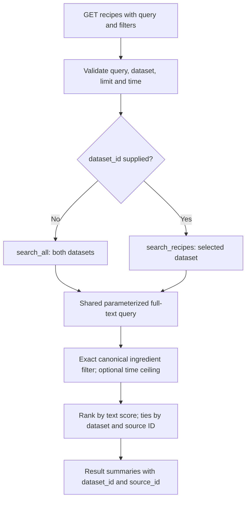
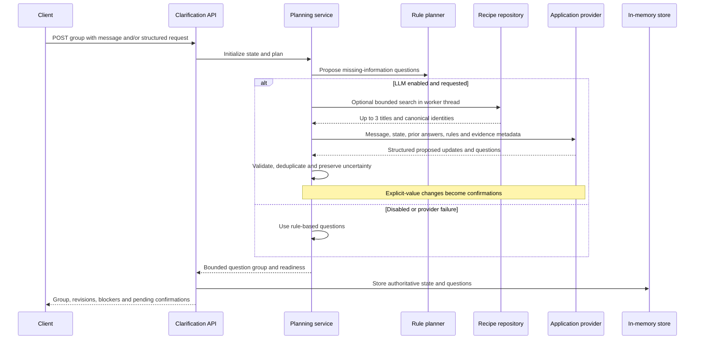
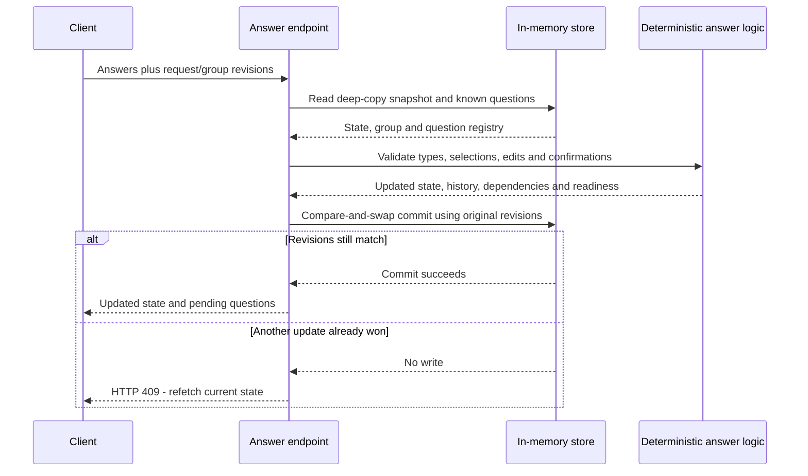
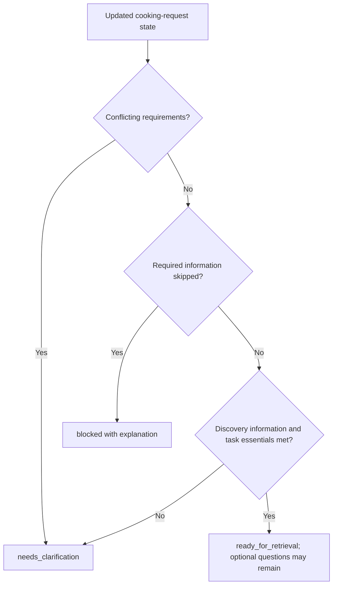
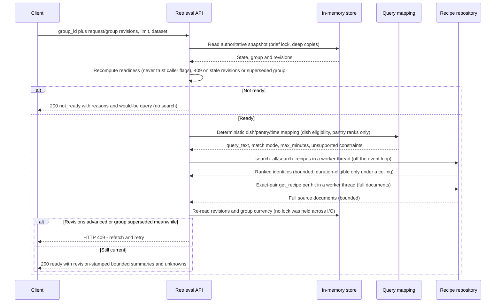
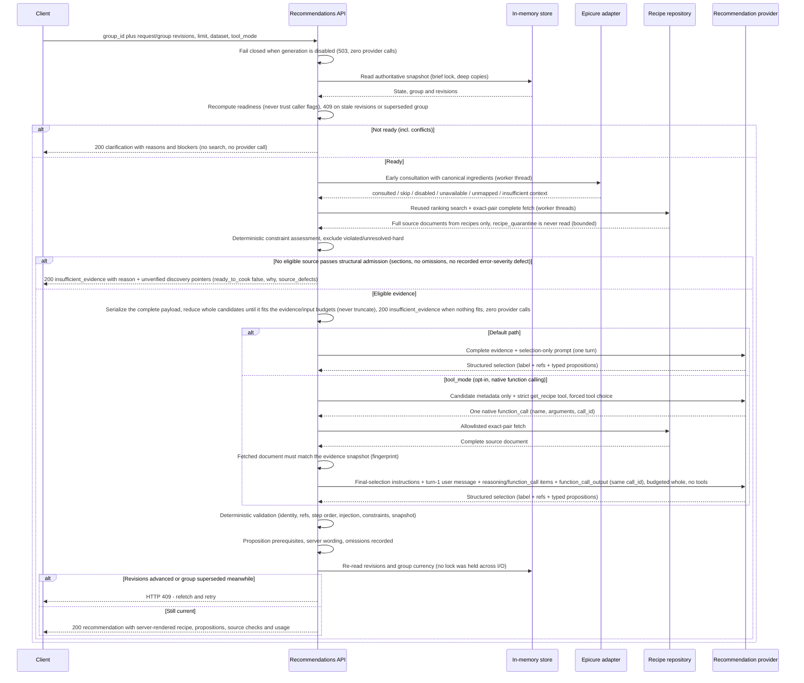
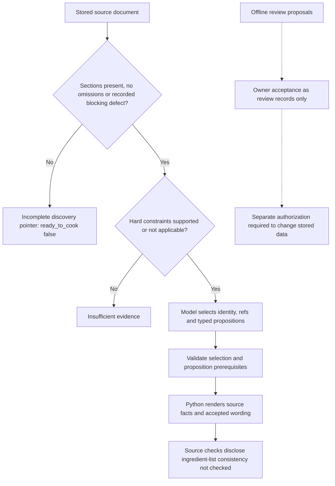

# API request flows

Part of the [current architecture](README.md). These are the current code paths.

## 1. API surface

| Method and path | Behavior |
|---|---|
| `GET /health/live` | Process health |
| `GET /health/ready` | PostgreSQL connectivity |
| `GET /api/v1/recipes` | Combined full-text search; optional dataset filter |
| `GET /api/v1/recipes/{source_id}` | Canonical recipe document lookup |
| `GET /api/v1/pairings` | Optional local Epicure neighbors |
| `POST /api/v1/clarification/groups` | Create structured request state and initial questions |
| `GET /api/v1/clarification/groups/{group_id}` | Read state and group |
| `POST /api/v1/clarification/groups/{group_id}/answers` | Validate answers or edits, then atomically save |
| `POST /api/v1/clarification/groups/{group_id}/replan` | Explicit follow-up planning; at most five successful replans per request |
| `POST /api/v1/retrieval/search` | Revision-pinned bounded evidence summaries for a ready clarification group (Phase 1; see `docs/retrieval.md`) |
| `POST /api/v1/recommendations` | Revision-pinned grounded selection for a ready group: `recommendation` / `clarification` / `insufficient_evidence` (Phase 3; see `docs/recommendations.md`) |

Retrieval returns ranked bounded summaries. Recommendations fetch
complete documents by exact identity and server-render the selected
recipe; the model performs selection only. Neither generates recipes.

## 2. Recipe discovery

Unknown durations are excluded by a time ceiling. Ingredient filtering is exact
canonical-name array containment, not semantic ingredient matching. Search does
not enforce cuisine, dietary restrictions, equipment or substitution compatibility.

Lookup with `dataset_id` matches that exact pair or returns 404. Without it,
legacy lookup tries Food.com first, then another dataset. Original IDs are
preserved exactly. Duplicate aliases are metadata, not independent lookup rows.

## 3. Creating questions

The rule-only path operates on structured information. It cannot interpret arbitrary
free text as an LLM would. Provider failure degrades to rules with error metadata;
unknown information must remain unknown. Group size defaults to six, with a maximum
of twelve. The future UI may present those questions serially; no UI exists yet.

The evidence helper currently selects search-result titles and dataset/source IDs,
with empty snippets. It does not fetch full recipes or pass the request's time
ceiling into that auxiliary search. This context is insufficient to prove recipe
suitability or a substitution's safety. Evidence retrieval is also distinct from
returning ranked recipe results to the user after clarification.

## 4. Answers, edits and concurrent requests

**Compare-and-swap** means “save only if nobody has changed the state since this
snapshot.” Validation and revision comparison are protected at the commit boundary.
Reads return copies, preventing accidental mutation of stored objects.

Answer submission never calls the LLM. A registry preserves previously issued
questions, so a user can edit an earlier answer after it leaves the pending group.
Dependencies can invalidate answers; history remains. Explicit no preference,
unknown, skipped and conflicting are separate states.

Replanning takes a snapshot, releases the lock, calls the provider if enabled,
then commits only if the request revision still matches. Successful replans advance
that revision. A concurrent answer makes the stale replan fail with 409; no store
lock is held during network work. This protection applies within one process only.

## 5. Readiness and corrections

For example, discovery may need only a dish or ingredients, while a scaling task
also requires portions. Ready does not mean allergy-safe, complete, scalable or
dietarily verified. Responses preserve `state.request`, field statuses,
`unenforced_constraints` and a `readiness_note` for future consumers.

Model-proposed changes to explicit answers create `keep_current` / `confirm_change`
questions. The stored value stays unchanged until confirmation. Updates to unknown
fields require adequate model confidence, a quote matching the current message, and
shape validation; those checks do not establish semantic truth.

Retrieval integration (Phase 1, implemented): `POST /api/v1/retrieval/search`
consumes the current clarification group plus expected revisions, translates
dish/pantry/time through the deterministic mapping in `retrieval/query.py`
(dish decides eligibility, pantry only ranks; pantry-only matches any
overlap), and returns bounded evidence summaries with all unresolved
constraints intact (see `docs/retrieval.md`). A superseded group gets a
controlled 409 directing the client to the current group; older groups stay
readable as history. The readiness flag alone still never implies safety,
nutrition, completeness, or scaling approval.

## 6. Retrieval for a ready group

Time ceilings are never relaxed to force a match; only finite positive
totals can satisfy a ceiling (zero, missing, negative, and non-finite are
unknown and excluded), and empty results carry an explanation naming the
datasets searched versus those represented. Pantry ingredients never gate
eligibility for dish queries. Unsupported constraints (cuisine, preferences,
dietary, equipment, substitutions) are preserved unchanged and reported as
unverified.

## 7. Recommendation for a ready group

Provider refusal is a controlled 502 (`provider_refusal`), never
insufficient evidence. Failed responses carry no recipe content. Epicure
suggestions are assessed after evidence (used as pairing notes only when
present in the selected source, otherwise deferred) and never enter the
rendered recipe.

## 8. Source checks and review decisions

Unknown quantities alone do not prove an ingredient-list inconsistency. Structural
admission does not detect ingredients mentioned only in instructions. Food.com
000322 remains presentable; ENR-03 records a defect proposal but has not changed
the database. The source review spec is never loaded as runtime policy.

Optional propositions that fail their prerequisites are omitted and recorded in
`rejected_propositions`; invalid selections or hard-constraint failures remain
controlled errors. No unrestricted model-authored explanation is published.
