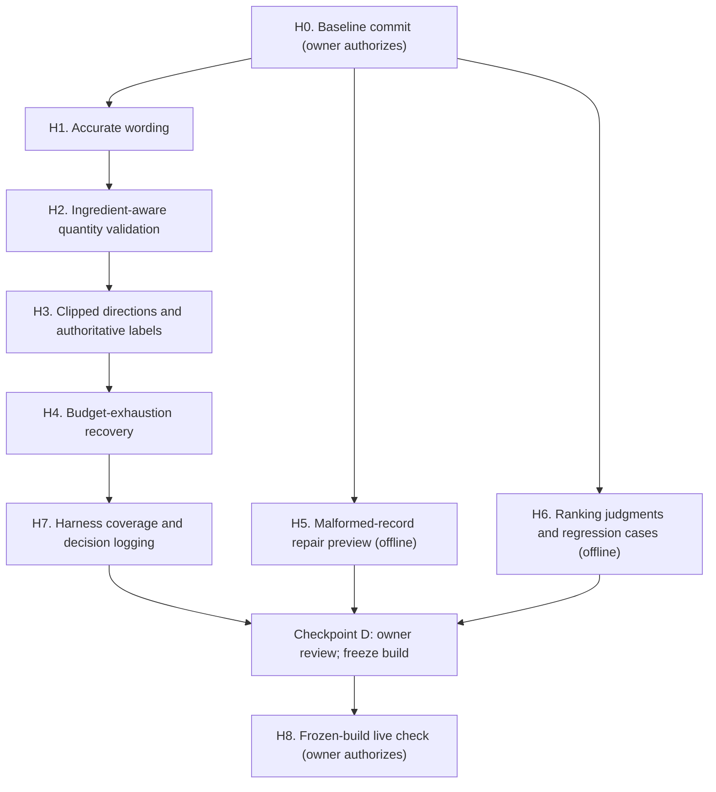

# Milestone 3 hardening plan: quantity, directions, budgets, data and ranking

Status: **H0 to H4 done** (H0 baseline `eae6f00` and H1 `a8aa69d` on
2026-10-07; H2, H3 and H4 on 2026-10-08). H5 onward not started. Known
failure until H7: harness case `p7-budget-tools` (see H4). Agent prompts per phase: `docs/milestone-3-hardening-prompts.md`. This plan follows the
owner's review of the 2026-10-06/07 demo-hardening work and the
five-session live evaluation (both recorded in
`docs/phase7-owner-decisions.md`). Baseline: branch
`m3-checkpoint-c-demo-hardening`, commit `a46f466` plus the uncommitted
2026-10-07 changes (14 files; `make check` 1209 passed, 8 skipped;
harness `phase7-cases-v8-2026-10-05` 43/43, results unchanged).

## Why this plan

The 2026-10-07 work fixed real failures, but the review found four places
where the protection is weaker than it was described, plus open items:

| Area | Current state | Gap |
|---|---|---|
| Plan quantities in prose | `plan_prose_quantity_errors` (`agent/validate.py`) checks each mass or volume amount against every amount the recipe states, pooled | The link to the ingredient is lost: with chicken 5 1/2 lb and potatoes 1 1/2 lb, "1 1/2 lb chicken" and "5 1/2 lb potatoes" both pass. It is a limited amount/unit check. |
| Source directions | Up to 12 directions of up to 600 characters reach the model, with `directions_clipped` | Not "in full": 184 recipes still have a clipped direction and 421 have more than 12 directions. The model has no way to read the rest before planning. |
| Source/adaptation label | The UI badges `model_adaptation` steps | The model's note is shown as written and can claim the directions were followed. |
| Budget exhaustion | A batch larger than the remaining tool calls stops the run at once (documented in `docs/agent.md`) | Two live sessions ended with "start a new session" while holding usable results. |
| Malformed records | 158 `odunola/foodie` records titled "summary", ingredients and directions collapsed | They appear in search results. |
| Title ranking | Title-first ranking tried and reverted | The comparison was inconclusive: replacement hits were unjudged. |
| Live confirmation | Five debugging sessions with code changes between runs | Party baking and allergy-aware completion are unconfirmed live. |

## Owner direction (recorded 2026-10-07)

- Keep the hardening changes. Leave global title-first ranking reverted.
- Prioritize ingredient-aware quantity validation, access to clipped
  directions, and a targeted repair preview for the malformed records.
- Improve budget-exhaustion recovery without raising limits.
- Expand the ranking judgments and regression cases before proposing a
  frozen-build live check.

## How to use this plan

Give the implementing agent the shared instructions and one numbered
prompt at a time; require a short evidence report per step (checks run,
files changed, what was not done). Stop at the human checkpoints. Steps
H5 and H6 are independent of H1–H4 and may run in parallel with them.



### Shared instructions: attach to every prompt

```text
Work in culinary-copilot on branch m3-checkpoint-c-demo-hardening. Read
AGENTS.md, docs/agent.md, docs/architecture/agent-system.md,
docs/phase7-owner-decisions.md and docs/milestone-3-hardening-plan.md.
Check the actual code before relying on any report, including this plan.

Implement only the assigned step. Preserve unrelated working-tree changes
(never reset, clean or stash), .env, frozen artifacts (earlier scenario
files, eval case versions, migrations 001-007, historical eval results)
and the untracked evals/phase3_agent/live-summary-*.json files.

No paid calls, model downloads, application-database writes or
migrations, commits, pushes or deploys unless this step's authorization
says so. The application database may be read only inside a read-only
transaction. Database write tests use disposable databases.

Never weaken validation merely to pass tests: diagnose whether the
fixture or the implementation violates the intended contract. Unknown
quantities, units, servings, dietary compatibility and nutrition stay
unknown. Recipe identity is (dataset_id, source_id).

Keep the demo limits (make demo: 40 steps, 40 tool calls) distinct from
the ordinary configuration (12 steps, 12 tool calls). Do not raise either.

Run make check and the phase 7 harness (uv run python
evals/phase7_agent/run.py; results.json must stay unchanged unless the
step says otherwise) plus evals/phase7_agent/verify_packet.py. Update
docs/agent.md and docs/architecture/*.md, distinguishing implemented
from planned behaviour, and describe protections by what they actually
check. Report checks actually run, skips and remaining limits.
```

## H0. Baseline commit

Commit the uncommitted 2026-10-07 work as one baseline so every later
step diffs against a known revision. **Needs the owner's authorization.**
Exclude `data/` and the untracked live-summary files; no co-author
trailer; body line "Implemented by an AI coding agent and reviewed with
AI assistance."

## H1. Accurate wording

```text
Implement step H1 (wording only; no behaviour change beyond the prompt
text named here).

1. docs/phase7-owner-decisions.md, section "Demo hardening follow-up
   (2026-10-07)": the bullet headed "Directions reach the model in
   full" is inaccurate. Do not rewrite the historical record; add a
   dated correction note below it: directions are expanded (12 x 600
   characters) with explicit clipping; 184 recipes still have a clipped
   direction and 421 have more than 12.
2. Describe plan_prose_quantity_errors everywhere it is documented as a
   limited amount/unit check: amounts are compared with every amount the
   recipe states, without the ingredient they belong to. Point to H2.
3. In the agent task framing (agent/loop.py), replace the instruction
   that party size or servings "never" changes the recommendation with:
   do not block initial options solely on unknown servings; ask about
   party size when it materially affects feasibility (equipment, batch
   preparation).
4. Describe the 16,000-character history setting as a retention
   heuristic, not a token or spending guarantee.
```

Evidence: the diff of the docs and the framing line; `make check`;
harness unchanged.

Done 2026-10-07: correction notes added under the three 2026-10-07
bullets in `docs/phase7-owner-decisions.md` (originals kept); the
quantity check described as limited in `docs/agent.md`,
`docs/architecture/agent-system.md` and the validator docstring; the
party-size framing reworded; the history limit described as a
retention heuristic in both docs and the code comment (the
`docs/agent.md` summary also said "first item plus newest", which no
longer matched `_cap_history`). `make check` 1209 passed, 8 skipped;
harness 43/43, 4/4 adversarial, results unchanged; `verify_packet.py`
all claims match.

## H2. Ingredient-aware quantity validation

```text
Implement step H2.

Replace the pooled check in plan_prose_quantity_errors with one that
ties each mass or volume amount written in the plan (mise_en_place,
steps, plating) to the ingredient it describes, and checks ingredient,
amount and unit together against that ingredient's source entries
(canonical/name, amount, unit, original line) and against the direction
it appears in. Reuse recipes/normalize.py::quantity and
recipes/llm_validate.py::canonical_unit; do not add a third parser.

Decide and document what happens when an amount cannot be attributed to
one ingredient (for example "2 cups of the liquid"): either it must
appear verbatim in a cited direction, or the plan is rejected with a
message naming the amount. Do not silently accept it.

Evaluate the stronger alternative and record the decision: render
mise_en_place amounts from the validated structured quantities instead
of model prose.

Regressions (offline):
- swapped ingredients: chicken 5 1/2 lb and potatoes 1 1/2 lb in the
  source; "1 1/2 lb chicken" and "5 1/2 lb potatoes" are rejected;
- total versus per-serving amounts;
- an amount stated only in a direction ("Heat 2 tablespoons oil") still
  passes when the step cites that direction;
- notation differences still pass (5 1/2, 5 ½, 11/2, 5.5).

Re-run the corpus self-check (each recipe's own ingredient lines and
directions as a plan must pass) read-only, and report the count. State
that it shows source text passes, not that wrong amounts are caught.
```

Evidence: new and updated tests; self-check counts; the decision on
prose versus rendered amounts.

Done 2026-10-08 (three review rounds; the reviews found false
rejections of the source's own lines, swaps passing through "of",
containers, descriptors and cited directions, all fixed and tested).
Matcher in `agent/plan_quantities.py`; rules and limits in
`docs/agent.md`. Unattributable amounts: decision (a), pass only
through a cited direction. Rendering mise en place from structured
quantities: evaluated, not adopted (it loses preparation wording and
needs handling for unknown amounts); revisit if live plans still need
quantity retries. Read-only self-check
`scripts/datasets/h2_quantity_selfcheck.py`: own lines 16,033/16,033,
"of" form 16,033/16,033, model-style 14,558/14,570, swaps rejected
11,227/11,229 (with and without descriptors; the 2 misses are amounts
the source states for both).

## H3. Clipped directions and authoritative labels

```text
Implement step H3.

1. Clipped directions: when the selected recipe has a direction cut at
   600 characters or more than 12 directions, the model must be able to
   read the omitted text before finishing the plan. Prefer a bounded,
   typed way to request it (for example get_recipe arguments selecting
   a direction range, or a dedicated tool) over raising the global
   limits. The plan finish for such a recipe must not succeed until the
   omitted directions were returned in this run, or the plan states
   which directions were not read (labelled as an adaptation).
2. Authoritative label: when steps_source is model_adaptation, the
   model's note and adaptations must not claim the steps follow the
   source (reject the claim, as the no-directions claim is rejected);
   in the UI, show the label next to the note as well as the steps.

Regressions: a recipe with a 700-character direction and one with 14
directions (plan blocked until the rest is read); a model_adaptation
plan whose note claims fidelity is rejected; a source plan is not.
```

Evidence: tests; how many corpus recipes need the new path (read-only
count); UI screenshot or DOM check.

Part 1 done 2026-10-08: `get_recipe` `directions_from`/`to` (at most 12
full directions per call); plan gate in `agent/validate.py`
(`validate_omitted_directions`); the review added the up-front turn-input
line (a gate rejection used the run's only validation retry), one-call
coverage of scattered unread indices, shared summary bounds, and
summary wording that keeps option comparison free of extra calls.
Read-only count: 605 of 16,033 recipes need the path (184 clipped, 421
with more than 12 directions); extra calls 1 for 589, 2 for 13, 3 for 2,
4 for 1; largest 12-direction slice 2,436 characters.

Part 2 done 2026-10-08: `plan_fidelity_errors` rejects fidelity claims
in a `model_adaptation` plan's note, adaptations and plan text; the plan
final now carries the model note (it had none before), and the UI shows
the validated label next to it. The review narrowed the negation window
to the three words before the verb (an eight-word window let 5 of 8
probe claims through), allowed claims about numbered steps, and added
common paraphrases. Corpus check: 3 source lines in 2 recipes match.

## H4. Budget-exhaustion recovery

```text
Implement step H4.

When the session's tool calls run out, or a batch asks for more calls
than remain, give the model one bounded finishing turn with no tools,
but only if the remaining steps, tokens, wall clock and spending limits
allow it. If they do not, or the finishing turn is rejected, stop with a
deterministic explanation that lists the useful results already in the
session (fetched recipes, options, plan) instead of only "start a new
session". Never reset or raise session allowances.

Keep the affordable-prefix rule (excess calls get typed errors). Update
docs/agent.md, which currently documents the immediate stop.

Regressions: batch larger than the remaining calls with evidence in hand
finishes; with the step or token budget also exhausted it stops with the
explanation; the finishing turn is offered at most once per run.
```

Evidence: tests; the updated stop-reason table.

Done 2026-10-08: the excess batch is followed by the ordinary final turn
(no tools), which passes the same step, wall-clock and token checks as
every turn; a failed check stops with `agent_tool_budget_exhausted` and a
deterministic list of fetched recipes, options, selected dish and plan.
The finishing turn ends the run whatever it returns. The review replaced
a duplicated affordability check (it left out the plan-requirement
lines) with the real checks, stopped a second model call when the
finishing turn calls tools anyway, and sorted the list.

Known failure until H7: harness case `p7-budget-tools` (cases v8) scripts
no finishing turn, so it now ends as `internal_error` and the harness
test fails (42/43; no other case changes). Cutting a new case version
during H4 was not permitted, so H7 makes the fix: script a finishing
turn for that case and add a case that keeps the immediate stop when the
finishing turn is unaffordable (for example an output ceiling of 600).

## H5. Malformed-record repair preview (offline)

```text
Implement step H5. Offline only: no application-database writes.

The 158 odunola/foodie records titled "summary" have ingredients and
directions collapsed into one line each. Find the cause in
recipes/adapters/foodie.py using the stored raw text, and fix the parser
for that source layout without changing results for correctly parsed
records (adapter version bump; keep the old version reproducible).

Produce a before/after preview for all 158 records (title, ingredient
lines, directions, quantities) and a regression check over a sample of
correctly parsed records showing no change. Determine whether
deterministic reprocessing repairs them without paid extraction.

Write the preview under data/ (not committed) and a summary in the
evidence report. Re-ingestion of the application database is a separate
action that needs the owner's approval, a verified recoverable backup,
and checks that recipe identities, provenance, directions, quantities,
search vectors and embeddings stay consistent.
```

Evidence: parser diff and tests; preview counts (repaired, unchanged,
still malformed); the proposed re-ingestion procedure.

## H6. Ranking judgments and regression cases (offline)

```text
Implement step H6. Offline and read-only against the application
database.

1. Re-run the title-first comparison against the frozen Phase 1 cases,
   writing outputs outside the repository's historical result files
   (scripts/retrieval_eval/run_baseline.py writes a committed artifact;
   redirect its output).
2. For the 14 cases whose top 5 changed, list the newly introduced
   unjudged hits and prepare judgments under the existing evaluation
   policy (evals/results/phase1/README.md). Store them as a new,
   versioned judgment set; never edit the original labels or benchmark.
3. Add regression cases that separate a requested dish from an
   ingredient phrase: "adobo" (dish) versus recipes containing
   "chipotle peppers in adobo sauce" (ingredient).
4. Compare the existing ranking with a bounded title boost for explicit
   dish requests (for example ts_rank weights with setweight on the
   title, not unconditional precedence), keeping ingredient discovery
   separate. Report both against the original and expanded judgments.

Do not change the production ranking in this step. The result is a
proposal for the owner.
```

Evidence: judgment file and version; comparison table; proposal.

## H7. Harness coverage and decision logging

```text
Implement step H7.

1. Add a new harness case version (do not edit cases v8) covering the
   2026-10-07 recovery paths: technique answer after a plan keeps the
   phase; a dropped option is named in the feedback; a negated mention
   is not a pairing claim; the wrap-up withholds only repeated tools; a
   repeated search is marked; the select phase withholds recipe search
   and pairings; a named allergy ("tree nuts") is checked; the
   allergy line keeps constraints_honored empty; plus H2-H4 behaviour,
   including the `p7-budget-tools` fix described under H4.
   Re-baseline results for the new version only and update
   verify_packet.py.
2. Record observable decisions in session events: tools offered and
   withheld per turn (with the reason), repeated results, validation
   failures and remaining budgets. Never record raw model reasoning. If
   the provider offers reasoning summaries, they may be recorded as
   optional diagnostics, labelled as such, never used for decisions.
3. Make export_session.py show these fields.
```

Evidence: new case version and hash; harness results; an exported
offline session showing the new fields.

## Checkpoint D (owner)

Review H1–H7 evidence. Decide:
- whether to apply the H5 re-ingestion (separate action, backup first);
- whether to adopt the H6 ranking proposal;
- whether to freeze the build for H8: record the commit SHA and the full
  configuration, and approve the live budget.

## H8. Frozen-build live check (owner authorizes)

Run only after Checkpoint D, on the frozen commit and configuration, with
no code changes between sessions. Scope: the party-baking request (vague
request, options, selection, plan, technique question) and the
allergy-aware flow (unnamed allergy, question, named answer, checked
options, plan, technique question). Report per session: outcome, steps,
tool calls, tokens, cost, validation failures, and any claim not
supported by its sources. The 2026-10-07 sessions stay as diagnostic
evidence, not confirmation.

## Out of scope

Raising session limits; global title-first ranking; application-database
writes outside an approved H5 re-ingestion; LangGraph, tracing platforms,
deployment and CI gates (later milestones).
