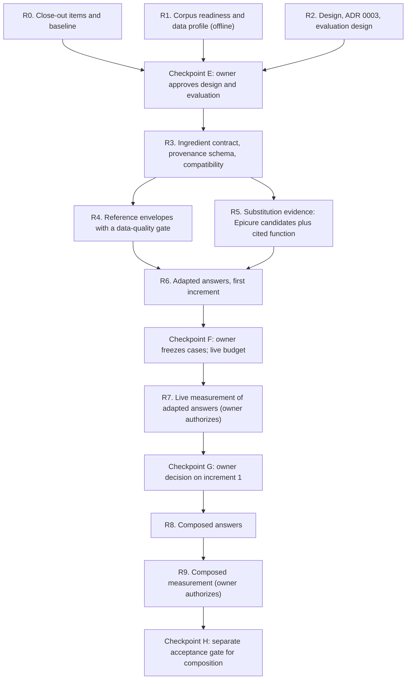

# Milestone 4 plan: recipes as references, the AI as the cook

Status: **draft revision 2, not approved** (2026-10-09). Revision 1
(2026-10-08) was reviewed; this revision addresses the review (see
"Revision history"). Follows the close of Milestone 3
(`docs/milestone-3-hardening-plan.md`, "Close-out"). Branch for this
work: to be cut from `m3-checkpoint-c-demo-hardening` after the owner
decides on pushing and merging it.

## Goal

Answer what the user asked for, not only what the database holds. Stored
recipes, technique chunks and Epicure become references the model
builds on: it may follow a recipe, adapt it, or compose a new one from
several. Every part of the answer says where it came from. Checks stay
strict where an error causes harm or misattribution, and become
plausibility checks where the model creates, but only where the
evidence supports a check. Where it does not, the answer says so; a
missing check never counts as a pass.

## Where Milestone 3 leaves us

| Part | Today | Limit |
|---|---|---|
| Recipe retrieval (15,875 recipes) | Search, fetch 2–3, offer them as options; a plan must come from one selected recipe | A request with no close match ends in a question offering the nearest recipe; nothing is composed |
| Technique chunks (34 documents, 253 chunks) | Technique answers cite returned chunks; raw-protein plans cite food safety | Fine as grounding; small corpus, no substitution guidance |
| Epicure (pairings, substitutions) | Queried by default before options; at least one returned pairing named in `epicure_lines` | Shapes no plan; in the six H8 option answers, 6 of 38 pairing lines were marked used. `find_substitutions` returns balanced-pairing candidates labelled unverified: flavour relationships, not evidence of cooking function |
| Adaptations | Free-text `adaptations` and `model_adaptation` steps are allowed | Any amount the source does not state is rejected, so a swap cannot carry its quantity |
| Dietary and allergy needs | Recipes that violate the restriction are dropped | A recipe one ingredient away is excluded instead of adapted |
| Plan schema | Steps with direction citations, up to 20 quantity claims, free-text adaptations | No complete final ingredient list, so checks see quantity claims and prose, not the full set of ingredients |
| Checks | Deterministic: quantity attribution, pairing claims, time/temperature claims, fidelity wording; one retry, none on a finishing turn | After the stall fix, three H8 runs were lost to false positives (an allergen named in a note; list quantity attribution; an equipment size, which used the only retry before a correct fidelity rejection ended the run). One failure was the model's, not caught by a check: a follow-up answered by re-issuing the plan with partly unsupported advice |

Corpus facts (read-only, 2026-10-08/09):

- Ingredient lines with both a structured amount and a unit: foodie
  104,262 of 140,237; food.com **0 of 9,680**. An amount alone does not
  make lines comparable.
- Servings stated: foodie 179 of 14,659 recipes; food.com 815 of 1,216.
- Directions of two words or fewer: 1,219 across 1,121 recipes, 521
  distinct texts. They mix non-instructions (author names, "allrecipes",
  "unknown", "nutrition:") with real steps ("serve immediately.", "mix
  well.", "drain.", "serve cold.").
- Both H8 plans that completed were labelled `model_adaptation`.

## Principles

1. **Provenance on every element.** Each ingredient, step, quantity and
   claim is one of:
   - `source`: from a named stored recipe. Ingredients, amounts and
     titles exact; steps faithful to the cited direction (condensing is
     allowed, a changed method is not), as Milestone 3's step citations
     already require.
   - `adapted`: changed from a source element, with the reason and its
     basis.
   - `generated`: the model's, with its basis where there is one.

   The UI shows it.
2. **Strict where harm or trust is at stake.**
   - Allergens and hard dietary constraints hold on the final
     ingredient list, generated and compound ingredients included; an
     ingredient that cannot be resolved stays unresolved, never passes.
   - Ingredient checks say nothing about cross-contact; answers never
     call a dish safe or free of an allergen and say cross-contact is
     not covered.
   - Food-safety values cite a returned chunk.
   - Anything labelled `source` meets the source rule above.
   - Claims attributed to Epicure name a returned result.
3. **Plausibility only with evidence.** A generated or adapted amount,
   time or temperature passes a plausibility check only against an
   envelope built from enough comparable, normalized evidence. Without
   that evidence the outcome is `insufficient_evidence`: recorded,
   shown, and never treated as a pass (see R4).
4. **Epicure proposes; function decides.** Epicure supplies candidate
   ingredients and flavour relationships. A replacement also needs a
   justification for the role the ingredient plays (binding, moisture,
   leavening, emulsification, structure, fat, acidity) and its quantity,
   from cited substitution guidance (see R5). Flavour similarity alone
   never justifies a swap or its amount.
5. **Answers never write back.** Generated content never enters
   `recipes`, never becomes a stored amount, and never changes a record.
   The data-integrity rule in `AGENTS.md` ("Unknown quantities ...
   remain unknown. Do not invent values") keeps governing the corpus; a
   separate, owner-approved rule governs labelled answer content
   (Checkpoint E).
6. **Honest about testing.** An adapted or composed recipe is labelled
   untested; the note says what was changed and why.

## Answer kinds

| Kind | When | Built from | Strict | Plausibility |
|---|---|---|---|---|
| Source | A stored recipe fits as is | One recipe | Everything (Milestone 3 checks) | — |
| Adapted | A stored recipe fits after changes (restriction, pantry, scale with a known anchor, technique, style) | One recipe, cited substitution guidance, Epicure candidates, technique chunks | Unchanged elements meet the source rule; allergens; food safety | Changed amounts, times, temperatures, where evidence suffices |
| Composed | No stored recipe is close enough, or the user asks for something new | 2–5 fetched reference recipes plus the above | Allergens; food safety; any element labelled source | All generated amounts, times, temperatures, where evidence suffices |

"Close enough" is measured, not left to the model alone: ingredient and
title overlap between the request (with confirmed answers) and the best
fetched recipe, plus the constraint check. The model proposes the kind;
the loop checks it against the measure and the evidence.

**Scaling.** Ratios alone cannot scale a recipe: doubling every amount
keeps them. Scaling needs a batch-size anchor (stated servings or yield,
pan size, piece count). Without one, the answer is a generated batch
with an estimated yield, labelled as such, not a verified scaling.

**Delivery order.** Adapted answers are the first increment, starting
with a small set of well-supported adaptations. Composed answers stay
in scope but follow once the ingredient contract and plausibility
checks show useful coverage, with their own acceptance gate.

## Phases

Each phase delivers its own regression cases (offline harness, new case
version, history kept) alongside the code; Checkpoint F freezes them.

### R0. Close-out items and baseline

- Owner: review the two completed H8 transcripts against the
  predeclared criteria; reconcile the 2026-10-06/07 spend; decide push
  and merge of the Milestone 3 branch.
- Optional, owner-authorized: a measurement batch on the final
  Milestone 3 build (fresh scenarios per workflow, each run more than
  once, no fixes between) to give Milestone 4 a measured baseline,
  from the existing H8 pool.

### R1. Corpus readiness and data profile (offline, read-only)

- **Non-instruction directions, per direction index.** Classify each of
  the 1,219 short directions (and any longer candidates found) with the
  evidence for the call: author credit, site name, placeholder,
  heading, or real step. "Stir well." is a step; an author's name is
  not.
  Propose a per-index flag; plans may skip flagged indices without
  losing the source label. Application-database writes only after an
  owner decision, with the H5-style procedure.
- **Faithful-copy sweep, split in two.**
  - *Attribution correctness*: a plan copied from a recipe's own lines
    and directions must pass the attribution checks (quantity
    attribution, source labels, fidelity). A failure here is a
    candidate false positive.
  - *Plan eligibility*: constraint, safety and consistency checks may
    rightly reject a faithful copy (a restriction conflict, missing
    food-safety evidence, inconsistent source quantities).

  Classify every failure before any validator change; a check is
  relaxed only when the classification shows it wrong.
- **Data profile for envelopes.** Per dataset and category: lines with
  amount and unit, unit families, unparseable amounts, duplicates and
  aliases, servings and yield coverage. Food.com currently contributes
  no ratio evidence (no line has both amount and unit).
- **Category map.** Coarse category and, where it matters, method
  subtype (creamed butter cake, oil cake, sponge; drop, rolled or bar
  cookie; yeast or quick bread), from title, ingredients and
  directions. Record coverage and unknowns.

### R2. Design, ADR 0003 and evaluation design

`docs/adr/0003-references-not-answers.md`:

- answer kinds, provenance model, the source rule, the check matrix
  (strict / plausibility / label only / insufficient evidence);
- the ingredient contract (R3) and the compatibility path for legacy
  answers;
- the closeness measure; scaling and its anchors;
- Epicure's role and the substitution-evidence model (R5);
- what is never generated (food-safety values without a chunk, allergen
  or cross-contact claims);
- UI labels; the proposed `AGENTS.md` wording for labelled answer
  content;
- worked examples: an egg-free version of a stored cake, a pantry swap,
  a doubled batch with and without a yield anchor, a dish the corpus
  lacks.

Evaluation design, in the same phase so it guides implementation:

- **Rubric** for what the checks cannot see: fit to the request,
  likelihood the recipe works, clarity of labels. Owner-scored; an AI
  judge only if the owner approves it, calibrated against owner scores.
- **Representative cases**: requests that fit a stored recipe, need a
  supported adaptation, need an adaptation the evidence cannot support
  (expected: insufficient evidence or a question), and have no close
  match; the two Milestone 3 workflows for comparison.
- **Failure criteria and metrics**: unsupported claims, constraint
  violations, false rejections, insufficient-evidence outcomes,
  completion, and cost per answer. Demo-limit and ordinary-limit
  results reported separately. One run per scenario is a first look;
  consistency needs repeated runs of the same build.

### Checkpoint E (owner)

Approve or amend: the design and check matrix, the ingredient contract,
the `AGENTS.md` wording, the non-instruction flag, the substitution
evidence sources (R5), the rubric, cases and failure criteria, and
whether the Epicure-before-options rule is kept.

### R3. Ingredient contract, provenance schema, compatibility

- **Final ingredient list**, structured and complete: every ingredient
  the plan uses, with amount, unit and provenance, including additions,
  replacements, garnishes, greasing and dusting, and compound
  ingredients (cake mix, pie filling, stock) with their components
  marked unresolved when unknown.
- **Consistency checks** between the list and the text: no step or
  mise-en-place line uses an ingredient missing from the list (removing
  butter must not leave "grease with butter"), and no listed ingredient
  goes unused without a reason.
- Allergen and diet checks run on that list; unresolved ingredients
  report as unresolved; the answer states that cross-contact is not
  covered.
- Provenance (`source` / `adapted` / `generated`) and `basis` (source
  line or direction index, substitution guidance, Epicure result,
  reference recipe, technique chunk) on ingredients, steps and claims;
  `references` for composed plans.
- **Versioned compatibility.** Milestone 3 answers carry a legacy
  schema version and keep their labels (`source`, `model_adaptation`,
  technique answers, web answers). They stay readable and are never
  upgraded to the new provenance claims. Only answers produced under
  the new schema carry new labels.

### R4. Reference envelopes with a data-quality gate

- **Normalization**: units into dimension families; volume-to-mass only
  with ingredient-specific densities from a cited table, otherwise
  compare within a family only; missing or unparseable values excluded,
  never imputed.
- **Comparable recipes**: same category and method subtype; duplicates
  and aliases count once.
- **Minimum evidence**: a minimum number of independent references per
  envelope (owner-set at Checkpoint F); robust ranges (median and
  quantiles) with outliers trimmed; source counts stored with each
  envelope.
- Per answer, the envelope comes from the references fetched in the
  session when they meet the minimum, else from the versioned category
  file, else the outcome is `insufficient_evidence`.
- Envelopes stored as a versioned file, not in the database. Coverage
  per category reported; categories below the minimum are listed, not
  hidden.

### R5. Substitution evidence: Epicure candidates plus cited function

- Epicure keeps its role: candidate ingredients and flavour
  relationships, labelled unverified as today.
- A separate, cited substitution table states, per common replacement,
  the function replaced and the replacement quantity, for example egg as
  binder, leavening or moisture, butter as fat or structure. Sources
  are vetted references (for example tested baking guidance), added to
  the technique corpus with provenance and licence notes; the owner
  approves the sources at Checkpoint E.
- An adapted swap needs both: an Epicure or table candidate, and a
  table entry for the function and amount. Without the table entry the
  swap is offered as an unverified idea without an amount, or the
  answer asks.
- Decide at Checkpoint E whether options still require an Epicure line
  when no adaptation is planned.

### R6. Adapted answers, first increment

- One source recipe, changes labelled with reason and basis.
- Start with well-supported cases: allergen or diet versions covered by
  the substitution table, pantry swaps with table entries, scaling with
  a known anchor, technique changes backed by technique chunks.
- Recipes previously dropped for one violating ingredient become
  candidates for an adapted answer when the table covers the swap.
- Framing, loop and UI for adapted answers: per-element provenance
  badges, an "untested" banner, the basis shown on demand,
  insufficient-evidence outcomes shown plainly.
- Retries: a plausibility rejection gets one retry like today; strict
  rejections keep the current rule.

### Checkpoint F (owner)

Freeze the regression cases from R3 to R6, the envelope thresholds and
minimum evidence, the rubric and the scenarios; set the live budget;
freeze the build.

### R7. Live measurement of adapted answers (owner authorizes)

One frozen build, each scenario run more than once, no fixes between
runs. Report completion, rubric scores, unsupported claims, constraint
violations, false rejections, insufficient-evidence outcomes and cost,
by answer kind, demo and ordinary limits separately, against the
Milestone 3 baseline if R0 measured one. Checkpoint G: the owner decides
what ships from increment 1 and whether composition proceeds.

### R8. Composed answers

- Allowed when the closeness measure says no fetched recipe is close
  enough, or the user asks for something new.
- Fetch 2–5 references; generated amounts, times and temperatures pass
  envelopes that meet the minimum evidence; otherwise the answer
  reports insufficient evidence for those values or asks.
- Labelled "composed from references, untested", references listed.
- Its own regression cases; adversarial cases for a generated allergen,
  an implausible ratio, a food-safety value without a chunk, a forged
  basis, a composed answer labelled as source.

### R9 and Checkpoint H: composition acceptance

The same measurement as R7, for composed answers, on a frozen build
(owner authorizes). Checkpoint H is a separate acceptance gate:
composition ships only on its own evidence.

## Risks

- **Thin evidence.** Usable ratio evidence comes almost entirely from
  foodie, and many categories may fall below the minimum. Insufficient
  evidence will be common at first; the design must make it a useful
  answer, not a failure.
- **Function is not flavour.** Without the substitution table,
  adaptations reduce to unverified ideas. Its coverage limits increment 1.
- **Baking is unforgiving.** Wrong proportions fail silently; method
  subtypes matter as much as ratios.
- **Labels can mislead.** "Adapted" must not read as "verified", and an
  ingredient check must not read as an allergen guarantee; UI wording
  needs owner review.
- **More freedom, more cost.** Adapted and composed answers fetch more;
  turn and token budgets may need revisiting (owner decision, never
  raised silently).
- **Check drift.** Relaxing a check must follow a classified failure
  (R1), and the strict checks stay pinned by the harness.

## Rules carried over

No push, deploy, paid calls, downloads or application-database writes
without the owner's authorization. Never edit `.env`. Disposable
databases for write tests. Frozen artifacts stay frozen; case files are
versioned with history. Committed docs paraphrase model output. Owner
checkpoints are recorded, never signed, by an assistant.

## Revision history

- **Revision 1 (2026-10-08)**: first draft.
- **Revision 2 (2026-10-09)**: after a review that raised six issues
  and one correction, each checked against the code and data:
  1. Envelopes get a data-quality gate (normalization, conversions,
     subtypes, minimum independent references, outliers) and an
     `insufficient_evidence` outcome that never passes; scaling needs a
     batch-size anchor. Food.com has no line with both amount and unit.
  2. Epicure supplies candidates; replacement function and quantity come
     from cited substitution guidance (`find_substitutions` returns
     unverified balanced-pairing candidates).
  3. The faithful-copy sweep is split into attribution correctness and
     plan eligibility, with failures classified before any check
     changes; non-instructions are flagged per direction index (short
     directions include real steps).
  4. A complete structured final ingredient list with consistency
     checks against the text and an unresolved state; ingredient checks
     do not cover cross-contact.
  5. Legacy answers keep their labels through a versioned compatibility
     path (both completed H8 plans were labelled adaptations).
  6. Evaluation design moves into R2 and Checkpoint E, regression cases
     ship with each phase, and measurement covers unsupported claims,
     constraint violations, false rejections, insufficient evidence and
     cost, with repeated runs.

  Correction: not every H8 failure after the stall fix was a check
  rejecting a reasonable answer. Adapted answers become the first
  increment; composition keeps a separate acceptance gate.
