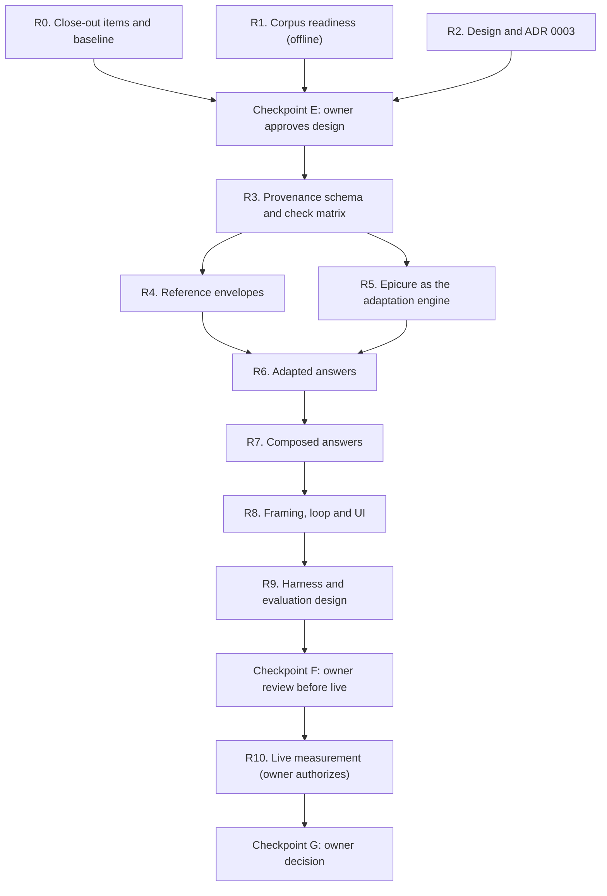

# Milestone 4 plan: recipes as references, the AI as the cook

Status: **draft, not approved** (2026-10-08). Follows the close of
Milestone 3 (`docs/milestone-3-hardening-plan.md`, "Close-out"). Branch
for this work: to be cut from `m3-checkpoint-c-demo-hardening` after the
owner decides on pushing and merging it.

## Goal

Answer what the user asked for, not only what the database holds. Stored
recipes, technique chunks and Epicure become references the model
builds on: it may follow a recipe, adapt it, or compose a new one from
several. Every part of the answer says where it came from. Checks stay
strict where an error causes harm or misattribution, and become
plausibility checks where the model is expected to create.

## Where Milestone 3 leaves us

| Part | Today | Limit |
|---|---|---|
| Recipe retrieval (15,875 recipes) | Search, fetch 2–3, offer them as options; a plan must come from one selected recipe | A request with no close match ends in a question offering the nearest recipe; nothing is composed |
| Technique chunks (34 documents, 253 chunks) | Technique answers cite returned chunks; raw-protein plans cite food safety | Fine as grounding; small corpus |
| Epicure (pairings, substitutions) | Queried by default before options; at least one returned pairing named in `epicure_lines` | Shapes no plan; in the six H8 option answers, 6 of 38 pairing lines were marked used, the rest rejected or not used. A ritual, not a capability |
| Adaptations | Free-text `adaptations` and `model_adaptation` steps are allowed | Any amount the source does not state is rejected, so a swap cannot carry its quantity |
| Dietary and allergy needs | Recipes that violate the restriction are dropped | A recipe one ingredient away is excluded instead of adapted |
| Checks | Deterministic: quantity attribution, pairing claims, time/temperature claims, fidelity wording; one retry, none on a finishing turn | Every H8 failure after the stall fix was a check rejecting a reasonable answer |

Corpus facts relevant here (read-only, 2026-10-08): foodie recipes state
servings in 179 of 14,659 records, food.com in 815 of 1,216; foodie
ingredients carry an amount in 133,949 of 140,237 lines, food.com in
2,518 of 9,680; 1,121 recipes have a direction of two words or fewer.

## Principles

1. **Provenance on every element.** Each step, quantity and claim is
   one of: `source` (copied from a named stored recipe, exact),
   `adapted` (changed from a source element, with the reason and its
   basis), or `generated` (the model's, with its basis where there is
   one). The UI shows it.
2. **Strict where harm or trust is at stake.**
   - Allergens and hard dietary constraints hold on the final
     ingredient list, including generated ingredients. Never "safe" or
     "free of".
   - Food safety (internal temperatures, holding times, raw handling)
     cites a returned chunk.
   - Anything labelled `source` is exact: amounts, steps, title.
   - Pairing and substitution claims attributed to Epicure name a
     returned result.
3. **Plausible where the model creates.** Generated or adapted amounts,
   times and temperatures are checked against reference envelopes
   (proportions and ranges from similar recipes), not against one
   source. Implausible values are rejected with the envelope; plausible
   ones pass, labelled.
4. **Epicure drives adaptation.** Substitutions supply swaps for
   restrictions and pantry gaps; pairings justify additions and
   variations. Its results become the `basis` of adapted elements
   instead of a separate list.
5. **Answers never write back.** Generated content never enters
   `recipes`, never becomes a stored amount, and never changes a
   record. The data-integrity rule in `AGENTS.md` ("Unknown quantities
   ... remain unknown. Do not invent values") keeps governing the
   corpus; a separate, owner-approved rule governs labelled answer
   content (Checkpoint E).
6. **Honest about testing.** An adapted or composed recipe is labelled
   untested; the note says what was changed and why.

## Answer kinds

| Kind | When | Built from | Strict | Plausibility |
|---|---|---|---|---|
| Source | A stored recipe fits as is | One recipe | Everything (today's checks) | — |
| Adapted | A stored recipe fits after changes (restriction, pantry, scale, technique, style) | One recipe plus Epicure and technique evidence | Unchanged elements exact; allergens; food safety | Changed amounts, times, temperatures |
| Composed | No stored recipe is close enough, or the user asks for something new | 2–5 fetched reference recipes plus Epicure and technique evidence | Allergens; food safety; any element labelled source | All generated amounts, times, temperatures against the references' envelope |

"Close enough" is measured, not left to the model alone: ingredient and
title overlap between the request (with confirmed answers) and the best
fetched recipe, plus the constraint check. The model proposes the kind;
the loop checks it against the measure and the evidence.

## Phases

### R0. Close-out items and baseline

- Owner: review the two completed H8 transcripts against the
  predeclared criteria; reconcile the 2026-10-06/07 spend; decide push
  and merge of the Milestone 3 branch.
- Optional, owner-authorized: a measurement batch on the final
  Milestone 3 build (three fresh scenarios per workflow, one run each,
  no fixes between) to give Milestone 4 a measured baseline. About
  $0.10–0.15 from the existing H8 pool.

### R1. Corpus readiness (offline, read-only)

- **Non-instruction directions.** Classify the 1,121 short directions
  (author credits, "Enjoy!", headings) and propose a flag at the
  document level; plans may then skip flagged directions without
  losing the `source` label. Application-database writes only after an
  owner decision, with the H5-style procedure.
- **Faithful-copy sweep.** For every recipe, render a plan copied from
  its own ingredient lines and directions and run the source-mode
  checks; any rejection is a check false positive. Fix them before
  building on those checks.
- **Category map.** Assign each recipe a coarse category (cake, cookie,
  bread, braise, sauce, ...) from title and ingredients, for the
  envelopes in R4. Record coverage and unknowns.

### R2. Design and ADR 0003

`docs/adr/0003-references-not-answers.md`: answer kinds, provenance
model, the check matrix (strict / plausibility / label only), the
closeness measure, Epicure's role, what is never generated (food-safety
values without a chunk, allergen claims), UI labels, and the proposed
`AGENTS.md` wording for labelled answer content. Include worked
examples: an egg-free version of a stored cake, a pantry swap, a dish
the corpus lacks.

### Checkpoint E (owner)

Approve or amend the design, the check matrix, the `AGENTS.md` wording,
the non-instruction flag, and whether the Epicure-before-options rule
is kept.

### R3. Provenance schema and check matrix

- Extend the plan with per-step and per-quantity provenance
  (`source` / `adapted` / `generated`), a `basis` (source direction
  index, Epicure result, reference recipe, technique chunk), and a
  `references` list for composed plans. Options gain the planned kind.
- Source mode keeps every Milestone 3 check. Adapted and composed modes
  route each element to its check by provenance.
- Allergen and diet checks run on the final ingredient list, generated
  lines included.
- Backward compatible: Milestone 3 answers validate as source mode.

### R4. Reference envelopes

- From the category map, compute per-category envelopes offline:
  ratios between key ingredient groups (flour, liquid, fat, sugar, egg,
  leavening for bakes; liquid to solids for braises and soups), and
  oven temperature and time ranges. Store as a versioned file with its
  source counts, not in the database.
- Per answer, the envelope comes from the references actually fetched
  in the session when there are enough, else from the category file.
- Checks report the envelope and the offending value; thresholds are
  owner-set at Checkpoint F.

### R5. Epicure as the adaptation engine

- Substitutions drive swaps for named restrictions and missing
  ingredients; the adapted element's basis names the result and its
  score.
- Pairings justify additions and variations, same basis rule.
- Unit and amount for a substitute come from the replaced amount and
  the envelope, labelled `adapted`.
- Decide (Checkpoint E) whether options still require an Epicure line
  when no adaptation is planned.

### R6. Adapted answers

- One source recipe, changes labelled with reason and basis.
- Typical cases: allergen or diet version, pantry swap, scaling with
  unknown servings (from the user's count and the envelope), technique
  change (oven to skillet), flavour variation.
- Recipes previously dropped for one violating ingredient become
  candidates for an adapted answer.

### R7. Composed answers

- Allowed when the closeness measure says no fetched recipe is close
  enough, or the user asks for something new.
- Fetch 2–5 references; every generated amount, time and temperature
  passes the envelope of those references; food-safety values cite a
  chunk.
- Labelled "composed from references, untested", with the references
  listed.

### R8. Framing, loop and UI

- Framing explains the three kinds, when to use each, and the
  provenance rules; the loop checks the kind against the closeness
  measure.
- Re-check retries: a plausibility rejection gets one retry like
  today; a strict rejection keeps the current rule.
- UI: per-element provenance badges, an "untested" banner for adapted
  and composed plans, references and Epicure bases shown on demand.

### R9. Harness and evaluation design

- Harness cases (new version, history kept): each kind passing;
  adversarial cases for a generated allergen, an implausible ratio, a
  food-safety value without a chunk, a forged Epicure basis, a
  composed answer mislabelled as source, a fidelity claim on an
  adapted plan.
- Evaluation rubric for quality the checks cannot see (fit to the
  request, likely to work, clear labelling), scored by the owner; an
  AI judge only if the owner approves it, and then calibrated against
  owner scores.
- Scenario set written before any live run: requests that fit a stored
  recipe, need adapting, and have no close match; the two Milestone 3
  workflows included for comparison.

### Checkpoint F (owner)

Review harness results, envelope thresholds, rubric and scenarios;
set the live budget; freeze the build.

### R10. Live measurement (owner authorizes)

One frozen build, every scenario once, no fixes between runs; report
completion rate, rubric scores and check rejections by kind, against the
Milestone 3 baseline from R0 if it was run. Then Checkpoint G: the owner
decides what ships, what is revised, and whether the strict source mode
stays the default.

## Risks

- **Baking is unforgiving.** Wrong proportions fail silently; the
  envelopes are the main defence, so their coverage per category
  matters more than the model's wording.
- **Labels can mislead.** "Adapted" must not read as "verified"; the UI
  wording needs owner review.
- **More freedom, more cost.** Composed answers fetch more references;
  turn and token budgets may need revisiting (owner decision, never
  raised silently).
- **Check drift.** Moving checks from reject to plausibility must not
  weaken the strict ones; R3 keeps them unchanged and the harness pins
  them.

## Rules carried over

No push, deploy, paid calls, downloads or application-database writes
without the owner's authorization. Never edit `.env`. Disposable
databases for write tests. Frozen artifacts stay frozen; case files are
versioned with history. Committed docs paraphrase model output. Owner
checkpoints are recorded, never signed, by an assistant.
