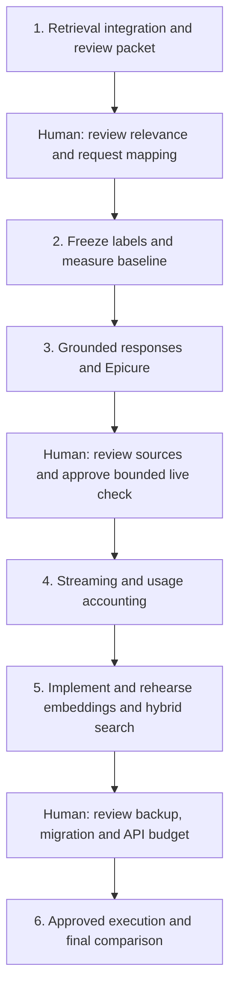

# Week 2 execution plan and agent prompts

Based on the architecture snapshot and code inspected on 2026-09-23, plus Milestone 2 in `../../ai-learning-plan.md`.
This is an implementation plan, not a claim that the remaining features exist.
No frontend work is included.

## What is already done, and what remains

| Week 2 item | Actual state | Action |
|---|---|---|
| Import and dataset-aware discovery | Implemented | Reuse; do not repeat ingestion |
| Clarification | Implemented, including corrections and concurrency protection | Integrate; do not rebuild |
| Async application provider | Implemented for clarification, with fake-provider tests | Extend for recommendations and streaming |
| Retrieval evaluation | Scaffold only | Build reviewed cases and measure full text |
| Clarification → full recipe evidence | Missing | Build first |
| Structured grounded responses | Missing | Build and review |
| Epicure in the workflow | Standalone endpoint works; clarification helper receives an empty ingredient | Implement effective recommendation-stage consultation |
| Usage and streaming | Partial clarification logging; no recommendation stream | Complete |
| Recipe embeddings, pgvector, hybrid search | Missing | Implement after baseline; evaluate before choosing a default |

The old guide's instructions to create clarification and the provider are stale.
Its zero-to-two question limit also predates the accepted grouped-question design
(default six, maximum twelve). Preserve the implemented clarification contracts.

## How to use this plan

Give the agent the **shared instructions** and one numbered prompt at a time.
After each phase, require a short report linking evidence and stating what was
actually executed. Continue through ordinary implementation fixes without another
permission loop. Stop at the explicit human checkpoints below.

The human reviews meaning and product behavior; the agent handles code, tests,
comparisons, and operational checks. A passing validator or fake-provider test
does not replace source-level review of real outputs.



### Shared instructions — attach to every prompt

```text
Work in culinary-copilot. Read AGENTS.md, README.md, docs/architecture/*.md,
docs/clarification.md, and docs/week-2-execution-plan.md. Check the actual code
before relying on historical reports. Read relevant runbooks where needed.

Implement only the assigned phase. Reuse the existing application provider,
clarification contracts, repository, and migration runner. Keep ingestion
separate. Preserve unrelated working-tree changes, .env, historical artifacts. No frontend, persistent-conversation project, web
search, autonomous agent loop, ingestion rerun, or unsolicited model change.

Offline implementation, read-only corpus inspection, and explicitly disposable
database tests are in scope. Do not make paid calls, download new model assets,
change the application DB/container, commit, push, or deploy unless separately
authorized for this phase. Prepare concrete commands, costs and recovery steps
before requesting execution approval. Do not ask again for existing approval.

Use exact (dataset_id, source_id) identities. Missing metadata stays unknown;
retrieval readiness is not safety, nutrition, completeness or scaling approval.
Never weaken evidence validation to improve acceptance counts.

For provider, streaming, embedding and pgvector implementation, inspect installed
versions and verify relevant current official documentation. Do not assume model
access, pricing, dimensions or parameters from old reports.

Run focused checks while developing and make check at phase completion. Keep
default tests offline and key-free; DB write tests use disposable databases.
Update affected architecture/contracts/runbooks, distinguishing planned and
implemented behavior. Report actual checks, skips, limits and next checkpoint.
Do not repeatedly audit the entire ingestion system or rerun unchanged checks.
```

## 1. Connect ready requests to retrieval and prepare review cases

**Outcome:** a useful backend discovery flow and a reviewable evaluation packet,
with no embeddings or generation yet.

### Prompt

```text
Implement Phase 1 of docs/week-2-execution-plan.md.

1. Add a retrieval service and a documented API entry point consuming an existing
   clarification group plus expected request/group revisions. Read authoritative
   state from the store. Reuse readiness/conflict checks; do not trust caller-sent
   ready flags. Return a controlled not-ready outcome and stale-revision 409s.
   Associate results with the snapshot revisions and detect intervening edits
   before publication without holding a store lock across I/O.
2. Define a deterministic request-to-query mapping using dish, ingredients and
   supported time filters. Distinguish available pantry ingredients from required
   recipe inclusions: do not require every available ingredient in every result.
   Do not silently relax explicit must-have filters. Explain empty results rather
   than secretly dropping constraints. Surface unsupported constraints unchanged.
   Keep standalone recipe search/lookup behavior compatible.
3. Reuse search_all/search_recipes and exact-pair get_recipe to fetch bounded full
   documents, not just titles. Return identities, provenance, quality/capability
   metadata, explicit unknowns and constraints not verified by retrieval. Run
   synchronous DB work off the async event loop. Enforce result/evidence limits.
4. Prepare 50 evaluation cases covering exact dishes, ingredients, paraphrases,
   time filters, missing metadata, both datasets, explicit dataset slices and
   no-match requests. Freeze a 30 development / 20 held-out split before tuning.
   Separate retrieval-only cases from request-to-query integration cases.
5. Inspect full source recipes to propose relevance judgments. Use a small graded
   rubric and exact pair IDs. Include relevant and irrelevant candidate examples,
   reasons and source links/excerpts in a readable review packet. Broaden candidate
   discovery beyond the current top five. Mark labels AI-proposed until reviewed;
   an empty search result alone does not prove no relevant recipe exists.
6. Add meaningful fake-repository and disposable-Postgres tests for state/revision
   handling, mapping, filters, full evidence, no-match and unknown metadata.

Deliver the working flow, review packet, test results, and commands. Stop before
declaring labels human-reviewed or publishing a definitive retrieval score.
```

### Human checkpoint 1

Review the packet in ordinary language; no code audit is needed:

- Does each query mean what you intended? Would pantry items accidentally restrict it?
- Read the proposed relevant recipes: would you accept them as search results?
- Check time limits, no-match judgments and unsupported dietary restrictions.
- Correct judgments and approve the 50-case set. Review held-out labels before tuning;
  do not use held-out failures as a development to-do list.

If you review only a subset, the remainder stays AI-labeled and results must report
that limitation. Do not present the whole set as manually reviewed.

## 2. Freeze judgments and measure full-text retrieval

### Prompt

```text
Implement Phase 2 using the human feedback attached to this prompt.

Apply only the approved relevance corrections, preserving reviewer type/status,
rubric version, split and source identities. Build a reproducible evaluation CLI
and reports. Compute Recall@5 and MRR with a declared relevance cutoff; report
no-relevant cases separately, including false positives/abstention. Explain that
recall is against the labeled pool, not exhaustive corpus relevance.

Measure p50/p95 latency with documented warmup, repetition count and environment;
separate query retrieval from full-document fetching. Report hard-filter violations
and per-query-type/dataset results. Record corpus/import fingerprints, search
configuration, code revision plus dirty-tree status, and evaluation-set hash.

Use development cases for any justified mapping corrections. Freeze the baseline
configuration and preserve original results. Keep held-out labels sealed from
tuning and reserve the final comparative run for Phase 6. Initial held-out numbers,
if reported, must not drive iterative changes. Never manufacture corpus IDs or
report fake-provider results as measured retrieval.

Run the baseline against the application corpus read-only if accessible. Otherwise
finish the harness and explicitly report that measurement is blocked by DB access.
Deliver a baseline report and proposed comparison criteria before adding vectors.
```

**Human role:** inspect a few successes and misses, and agree on what improvement
would justify hybrid retrieval: better relevance, zero supported hard-filter
violations, and acceptable latency/cost. The agent should propose concrete targets
from the measured baseline rather than inventing a passing score after evaluation.

## 3. Implement grounded recommendations and Epicure consultation

### Prompt

```text
Implement Phase 3 on the existing retrieval flow and provider boundary.

1. Add typed response contracts and POST /api/v1/recommendations. Consume validated,
   revision-specific request state. Return recommendation, clarification or
   insufficient_evidence with explicit reasons. Keep the retriever replaceable.
2. Implement a fixed workflow: readiness → Epicure consultation → ingredient-role
   and availability assessment → retrieval/full-source fetch → bounded generation
   → deterministic validation. Consult Epicure by default with real available
   canonical ingredients. Allow only a recorded simple-technique skip. Record
   disabled/unavailable/unmapped states distinctly; never claim consultation when
   it did not happen. Use existing cached assets or fakes unless a download is
   authorized. Similarity does not prove substitutions or dietary compatibility.
3. Extend, rather than replace, the async provider for structured recommendations.
   Bound evidence size, output, attempts and tool calls. Treat recipe text as
   untrusted data. Record which Epicure suggestions were used/rejected and concise
   reasons, not hidden reasoning. No autonomous loop or internet research.
4. Enforce evidence-backed citations and ingredient quantities/units; preserve
   instructions and distinguish sourced facts, proposed adaptations and unknowns.
   Unverified hard constraints must not become satisfied claims. Missing recipe
   capabilities remain unknown. Do not scale without supported quantities and
   servings. Exclude quarantined rows. A sourced discovery result is still useful
   when a complete adapted recipe cannot be justified.
5. Prepare a small, diverse source-level review packet and separate proposed
   enrichment fixtures with evidence/reviewer metadata. Do not alter imported raw
   documents or let an LLM fill missing facts. Human acceptance of examples must
   not upgrade capabilities across the corpus.
6. Demonstrate one bounded allowlisted get_recipe function-call exercise using
   exact IDs and validated arguments, followed by the provider's final response.
   Bound total provider turns, handle invalid/unknown calls, and test with fakes.
7. Test fabricated references, unsupported amounts, constraints, stale states,
   prompt injection, refusals, truncation, empty retrieval and Epicure failure.

Deliver offline behavior and source comparisons. Prepare an opt-in live evaluation
of at most 10 diverse requests: exact configured model, verified parameters/pricing,
token ceiling, retry-inclusive spend bound and stop conditions. Do not submit yet.
```

### Human checkpoint 2

Review proposed source/enrichment examples and expected behavior first. Approve or
correct how the backend handles unknowns, adaptations and insufficient evidence.
Then authorize the agent's concrete small live evaluation with a dollar ceiling.
After execution, read the real outputs beside the sources: were amounts invented,
steps changed, or unsupported constraints presented as satisfied?

One genuine unsupported claim in a successful response requires diagnosis and a
regression case before expanding usage. Repair locally and replay saved outputs
where possible; do not restart repeated full model-evaluation cycles.

## 4. Add streaming and complete telemetry

### Prompt

```text
Implement Phase 4 using the grounded recommendation service.

Add a separate SSE endpoint with documented stage, provisional delta, validated
final and error events. The non-streaming API remains supported. Never publish an
unvalidated recipe as final. Prefer progress events over exposing risky recipe
fragments; if deltas are exposed, mark them explicitly provisional. Bound buffers
and duration, handle provider failure/cancellation and client disconnect, and
close provider work where supported. Recheck request revisions before final output.

Record correlated request/group IDs, stages, model/config versions, latency,
attempts, input/output usage and estimated cost from versioned pricing. Include
failed/retried work where usage is known; unknown cost remains unknown. Fix the
existing clarification event gaps: rule-only/error outcomes need events and real
IDs must replace the placeholder 'pending'. Avoid logging full messages, recipe
prompts, secrets or sensitive constraints unnecessarily.

Test event ordering, exactly one validated final on success, no final on validation
failure, disconnect cleanup, bounded retries, unknown usage and offline mode with
fake streams/providers. Document a curl-based manual walkthrough; no UI required.
No live calls are authorized by this prompt.
```

**Human role:** use the curl walkthrough to check that progress is understandable
and provisional content cannot be confused with the authoritative final response.

## 5. Prepare embeddings and hybrid retrieval; rehearse safely

### Prompt

```text
Implement Phase 5. No application DB/container changes or paid embedding calls yet.

1. Inspect installed PostgreSQL, applied migrations, model configuration and current
   official pgvector/provider docs. Propose an accessible embedding model and
   dimension with explicit pricing assumptions; do not silently choose a new model.
2. Prepare a reviewed PostgreSQL-17-compatible pgvector image change preserving the
   current volume/major version. Add the next unused migration, leaving applied
   migrations unchanged. Track exact recipe identity, model/dimension, renderer
   version, source content hash and vector/chunk identity. Document stale-vector
   exclusion, deletion handling and migration transaction/rollback behavior.
3. Build an explicit resumable embedding CLI with versioned text rendering, token
   length handling, bounded input batches/concurrency/retries, checkpoints, a
   conservative budget reservation and usage accounting. Do not embed on startup.
   Skip unchanged recipes; changed content invalidates old embeddings. Recipe text
   embeddings and Epicure vectors stay separate. Use fake embeddings for tests.
4. Implement exact vector search and RRF hybrid retrieval behind the same interface.
   Apply supported filters consistently. Deduplicate recipe IDs before fusion;
   multiple chunks must not inflate a recipe's rank. Fetch full sources afterward.
   Use configurable candidate counts and RRF constant; do not average raw scores.
   Avoid HNSW until measurements justify it. Keep full text as the default initially.
5. Rehearse migration/restore and retrieval on explicitly disposable PostgreSQL.
   Test zero-call reruns, partial failures, stale vectors, filter parity, no-match,
   dataset isolation and full-document identity. Do not claim synthetic-vector
   tests measure semantic relevance.
6. Prepare the application execution package: verified DB/volume identity, proposed
   image pin, backup/restore checks, exact migration commands, corpus token estimate,
   model/dimension, query-embedding costs, retry-inclusive dollar ceiling, resumable
   embedding commands, staging results, verification and recovery steps. Explain
   that SQL rollback alone cannot undo every container/image operation.

Deliver everything reviewable and stop before the application migration/live job.
```

### Human checkpoint 3

The agent does the operational preparation. You approve the **specific** model,
price/budget, database image/migration and embedding run after seeing the package.
No need to inspect thousands of vectors or all code. Do not reuse earlier ingestion
spend/migration approvals as authorization for this new operation.

## 6. Execute approved changes, compare, and finish

Attach the concrete approval from checkpoint 3 to this prompt.

```text
Complete Phase 6 within the attached model, migration and dollar authorization.

Verify target/configuration still match the approved package. Create and verify a
recoverable application backup before mutation; perform the rehearsed image/schema
change without replacing the volume. Verify original recipe/quarantine/import data
and lookup behavior survive. Run the approved bounded, resumable embedding job;
track actual plus reserved spend. Stop on a threatened ceiling, data-integrity
failure or a configuration change outside authorization; report concrete recovery.

Tune only with development cases, then freeze configurations and run full-text,
vector and hybrid against the same reviewed held-out cases. Record Recall@5, MRR,
no-match behavior, filter violations, query/full-workflow latency and query-embedding
cost. Disclose partial embedding coverage and incomplete relevance judgments.
Preserve full-text as default unless the pre-agreed criteria support a change.
An unfavorable hybrid result is a valid measured outcome; do not tune on held-out
failures to manufacture an improvement.

Write docs/scoreboard.md and a short ADR with model/dimension, renderer, fusion,
tradeoffs and chosen default. Update architecture diagrams and operational docs.
Run make check and relevant disposable-DB checks. Any live recommendation/streaming
smoke test needs an explicit remaining budget in the attached authorization.

Give a concise final checklist: implemented vs measured, corpus integrity, actual
spend, review status, reproducible commands, failures/limits and deferred work.
Do not commit/push unless specifically authorized.
```

## Completion criteria

- Clarified state reaches dataset-aware full-source retrieval without losing revisions
  or misrepresenting unsupported constraints.
- Reviewed evaluation cases and reproducible full-text/vector/hybrid comparisons exist.
- Recommendations have validated sources, honest unknowns and effective Epicure
  consultation or an explicit skip/unavailability outcome.
- Structured responses, bounded tool calling, streaming and usage accounting work;
  mocked checks and measured live behavior are reported separately.
- Recipe embeddings are resumable, budgeted and separate from Epicure; data survives
  the approved pgvector change.
- The retrieval default follows measured tradeoffs, not a requirement to favor vectors.

Frontend, durable conversations, web-search toggle, autonomous iteration, and further
Foodie boundary ingestion remain separate work. They are not prerequisites for this
backend milestone. Single-process, restart-volatile clarification remains an explicit
development limitation, not a production persistence solution.
